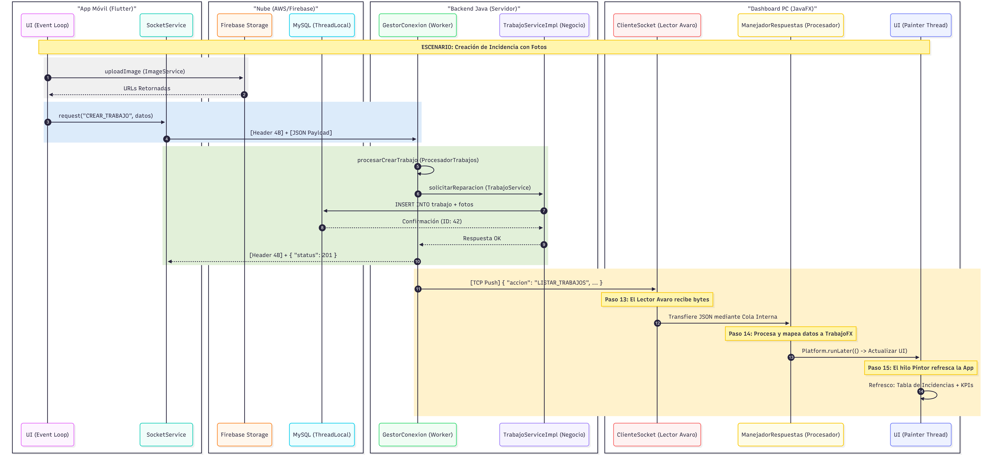
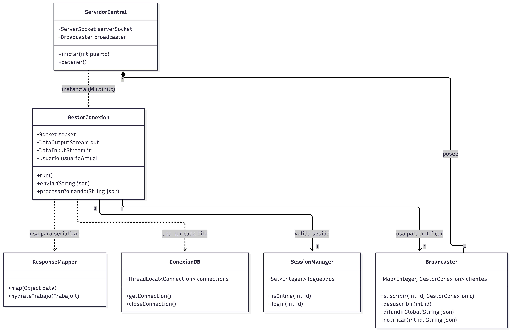

# Memoria Técnica del Proyecto

**Proyecto:** FixFinder — Sistema de Gestión de Incidencias y Reparaciones  
**Alumno:** Noé Conde Vila  
**Curso:** 2.º DAM — IES Maria Enríquez — Curso 2025-26  
**Fecha de entrega:** 29 de mayo de 2026

---

## Índice

1. [Introducción](#1-introducción)
2. [Presentación de las tecnologías](#2-presentación-de-las-tecnologías)
3. [Análisis del proyecto](#3-análisis-del-proyecto)
4. [Diseño del proyecto](#4-diseño-del-proyecto)
5. [Implementación del proyecto](#5-implementación-del-proyecto)
6. [Estudio de los resultados obtenidos](#6-estudio-de-los-resultados-obtenidos)
7. [Conclusiones](#7-conclusiones)
8. [Bibliografía y recursos utilizados](#8-bibliografía-y-recursos-utilizados)
9. [Anexos](#9-anexos)

---

# 1. Introducción

## 1.1. Presentación y motivación del proyecto

FixFinder surge de la necesidad de dar un paso adelante en la modernización y digitalización del servicio técnico y reparaciones. Muchas pequeñas y medianas empresas en el sector del mantenimiento utilizan sistemas antiguos y poco eficientes, como procesos manuales, publicidad en diferentes canales (radio, rrss, etc), llamadas telefónicas constantes y partes de trabajo en papel. Esto provoca ineficiencias y falta de transparencia y comodidad para el cliente final.

FixFinder es una plataforma completa que integra a clientes, operarios y gerentes de empresas en tiempo real. Permite dar soporte a todas las actividades involucradas en una reparación doméstica, desde que el cliente avisa una avería en su teléfono móvil, pasando por la presupuestación del gerente en su sistema de empresa, hasta la ejecución por parte del operario. El objetivo es dar con una herramienta profesional que ayude a mejorar la eficiencia interna y la satisfacción del cliente en cuanto a la búsqueda de servicios de reparaciones domésticas.

---

## 1.2. Factor diferenciador del proyecto

Lo que destaca de FixFinder no es su tecnología, ni frameworks ni librerias, es cómo le da la vuelta al modelo tradicional de buscqueda de servicios técnicos. Tradicionalmente es el cliente el que busca en internet empresas, contacta con ellas una a una y gestiona la comunicación de forma individual. En FixFinder el cliente sube a la plataforma el problema como si de una red social se tratara, y las empresas son las que valoran y presupuestan el servicio. Dando a los clientes una comodidad estando a la espera en lugar de hacer una búsqueda activa, y a las empresas un abanico de potenciales clientes sin necesidad de invertir en publicidad.

---

## 1.3. Análisis de la situación de partida

Todos conocemos a alguien, y si no, ese alguien seguramente seas tú, que cuando se rompe el grifo de la cocina y no conce a ningñun fontanero, se pone a preguntar a amgiso y familiares si conocen alguno fiable, o bien buscar en google sin ningún criterio ni seguridad de que sea un buen profesional. En lugar de buscar anuncios de empresas de servicios, ahora el anuncio lo pone el cliente y son las empresas las que te ofrecen el servicio con un presupuesto directo, mientras las empresas tienen una fuente mas para aumentar su cartera de clientes por otra via.

---

## 1.4. Objetivos a conseguir con el proyecto

Con este proyecto he marcado unas metas muy claras:

1. **Flujo de trabajo completo:** Que todo el flujo de trabajo, desde la creación de la incidencia por el cliente, pasando por la gestión del gerente y la ejecución por parte del operario, se realice de forma fluida y sin interrupciones.
2. **Hacerlo fácil desde el móvil:** Que el cliente pueda pedir una reparación en segundos y quedarse a la espera a recibir presupuestos de empresas, y para el operario sea sencillo gestionar las incidencias que le llegan con toda su información.
3. **Controlar el negocio de un vistazo:** Que el gerente tenga en su pantalla todas las herramientas para presupuestar y asignar tareas sin perderse en menús complicados.
4. **Construir algo sólido:** Aprovechar la potencia y bajo costo de AWS y Firebase para que el sistema funcione de verdad y sea capaz de crecer si las empresas lo necesita.
5. **Seguridad ante todo:** Garantizar que los presupuestos y datos de los clientes estén a buen recaudo y con un sistema de seguridad delegado a aws para los datos y cifrado con tokens para la autenticación de usuarios.

---

## 1.5. Relación con los contenidos de los módulos

| Módulo                                                    | Relación con el proyecto                                                                                                                                                                                                    |
| --------------------------------------------------------- | --------------------------------------------------------------------------------------------------------------------------------------------------------------------------------------------------------------------------- |
| **Acceso a Datos**                                        | Aplicación de patrones DAO y Repository para la persistencia en MySQL. Uso de JDBC para la gestión de conexiones y consultas complejas, garantizando la integridad referencial y la eficiencia en la persistencia de datos. |
| **Desarrollo de Interfaces (DI)**                         | Diseño y desarrollo del Dashboard administrativo utilizando JavaFX. Uso de estilos CSS para una interfaz profesional y componentes personalizados para visualización de datos.                                              |
| **Programación Multimedia y Dispositivos Móviles (PMDM)** | Desarrollo de la aplicación dual para el cliente y operario con Flutter. Integración de cámaras para fotos de incidencias, consumo de servicios de red y uso de Firebase para almacenamiento de contenido multimedia.       |
| **Programación de Servicios y Procesos (PSP)**            | Arquitectura cliente-servidor mediante sockets TCP. Implementación de una arquitectura orientada a eventos mediante un sistema de Broadcaster global. Gestión avanzada de la concurrencia con hilos dedicados y sincronización de streams de salida para permitir actualizaciones en tiempo real (Push) entre clientes.                                   |
| **Sistemas de Gestión Empresarial (SGE)**                 | Modelado del ciclo de vida transaccional de una incidencia, desde el estado Pendiente hasta Finalizado, integrando flujos de aprobación de presupuestos y asignación dinámica de recursos humanos.                                               |
| **Optativa Nube**                                         | Arquitectura de despliegue híbrida y desacoplada: cómputo en AWS EC2, persistencia relacional en AWS RDS y almacenamiento de objetos multimedia en Firebase Storage, garantizando alta disponibilidad y escalabilidad de los recursos.                                                                |
| **Sostenibilidad**                                        | Contribución a la reducción del consumo de papel y transporte innecesario mediante la digitalización de partes de trabajo y la optimización de la comunicación remota entre actores.                                        |
| **Digitalización**                                        | Transformación de procesos tradicionales de mantenimiento en flujos de trabajo 100% digitales, permitiendo el análisis de datos para la mejora de la eficiencia operativa.                                                  |

---

# 2. Presentación de las tecnologías

## 2.1. Justificación de la elección de las tecnologías

Siendo sincero, empecé este proyecto a principio de curso queriendo anticiparme a la falta de tiempo futura, por lo que desarrollé toda la base de la forma que sabiamos en ese momento, de forma manual, sin frameworks ni librerias externas. Cuando finalizando el año y conocimos frameworks como Spring Boot, me di cuenta de que podria haberlo hecho de forma mas sencilla, pero ya era tarde para cambiar, así que aproveché para aprender como funcionan las cosas por debajo aunque requiera de mas trabajo, pero a la vez mayor aprendizaje.

Por ejemplo, en el servidor he pasado de los frameworks automáticos para gestionarlo directamente con **Sockets** de forma manual. Creando toda la lógica de comunicación y concurrencia desde cero. Para las interfaces, **JavaFX** me daba la seguridad por ser un entorno que ya conociamos, mientras que **Flutter** me permitia tener una app móvil moderna y rápida. Con **MySQL** aseguramos que nada se pierda y con **Firebase** nos quitamos el dolor de cabeza de gestionar la transmisión de imágenes pesadas.

#### Stack tecnológico utilizado

| Componente               | Tecnología                       | Justificación                                                                                                                                                       |
| ------------------------ | -------------------------------- | ------------------------------------------------------------------------------------------------------------------------------------------------------------------- |
| **Dependencias**         | Gradle                           | Gestión de dependencias y construcción del proyecto.                                                                                                                |
| **Servidor**             | Java (Sockets TCP)               | Control absoluto sobre el protocolo binario y gestión de concurrencia de alto rendimiento mediante Pool de hilos (Workers) y comunicación bidireccional asíncrona.                                                                       |
| **Protocolo**            | JSON                             | Formato de datos ligero y fácil de leer y escribir por humanos y máquinas.                                                                                          |
| **Base de Datos**        | MySQL + JDBC                     | Estándar de base de datos relacional para persistencia de datos con integración nativa en Java.                                                                     |
| **Persistencia**         | Patrón DAO y Repository          | Patrones de diseño para la persistencia de datos sin ORM.                                                                                                           |
| **Seguridad**            | bcrypt                           | Algoritmo de hashing para la encriptación de contraseñas.                                                                                                           |
| **Cliente Escritorio**   | JavaFX + CSS                     | Interfaz nativa potente y personalizada. Distribución profesional mediante Bundle Nativo (Portable EXE) generado con jpackage, eliminando la necesidad de que el cliente instale Java manualmente.                                                                       |
| **App Móvil**            | Flutter / Dart                   | Desarrollo multiplataforma con UI de alta calidad y rendimiento nativo.                                                                                             |
| **Almacenamiento Nube**  | Firebase Storage y AWS EC2 + RDS | Almacenamiento escalable de imágenes con acceso directo desde los clientes mediante URL, servidor en la nube y base de datos relacional para persistencia de datos. |
| **Control de Versiones** | Git + GitHub                     | Gestión eficiente de cambios y versiones durante todo el desarrollo.                                                                                                |

---

# 3. Análisis del proyecto

## 3.1. Requerimientos funcionales y no funcionales

#### Requerimientos funcionales

FixFinder tiene que ser capaz de llevar una reparación de principio a fin cubriendo cada proceso. Por eso, se han definido unos requisitos que aseguran que tanto el cliente que tiene una gotera como el gerente que tiene que gestionar la reparación, tengan todo lo que necesitan.

| ID    | Requerimiento                                                                    | Prioridad |
| ----- | -------------------------------------------------------------------------------- | --------- |
| RF-01 | Registro e inicio de sesión de usuarios (Clientes, Operarios, Gerentes).         | Alta      |
| RF-02 | Creación de incidencias por parte del cliente con descripción y fotos.           | Alta      |
| RF-03 | Visualización del listado de trabajos en tiempo real según el rol.               | Alta      |
| RF-04 | Emisión de presupuestos por parte del gerente para incidencias pendientes.       | Alta      |
| RF-05 | Aceptación o rechazo de presupuestos por parte del cliente.                      | Alta      |
| RF-06 | Asignación de operarios específicos a trabajos aceptados.                        | Alta      |
| RF-07 | Reporte de finalización de trabajo por parte del operario con informe.           | Alta      |
| RF-08 | Valoración del servicio recibido por parte del cliente (estrellas y comentario). | Media     |
| RF-09 | Gestión de perfil de usuario (edición de datos de contacto y foto).              | Baja      |

#### Requerimientos no funcionales

Los requerimientos no funcionales se centran en que el sistema sea seguro, eficiente y capaz de aguantar a muchos usuarios a la vez sin perder rendimiento.

| ID     | Requerimiento  | Descripción                                                                                                  |
| ------ | -------------- | ------------------------------------------------------------------------------------------------------------ |
| RNF-01 | Concurrencia   | El servidor debe ser capaz de gestionar al menos 100 conexiones simultáneas sin pérdida de datos.            |
| RNF-02 | Seguridad      | Las contraseñas deben almacenarse mediante hash (BCrypt) y la comunicación debe ser mediante protocolo JSON. |
| RNF-03 | Disponibilidad | El sistema debe estar preparado para su despliegue en la nube con un tiempo de actividad del 99%.            |
| RNF-04 | Escalabilidad  | La arquitectura debe permitir añadir nuevos tipos de procesadores de red sin afectar al núcleo del servidor. |
| RNF-05 | Usabilidad     | La App móvil debe funcionar con fluidez incluso en dispositivos de gama media-baja.                          |

#### Análisis de costes y viabilidad del proyecto

FixFinder es un proyecto totalmente viable porque aprovecha lo mejor del software libre. Además, el sistema está diseñado para vivir en la capa gratuita de AWS y Firebase hasta cierto punto siendo escalable bajo demanda, lo que significa que una empresa podría empezar a usarlo mañana mismo con un coste de infraestructura de cero euros. El valor real está en las horas de desarrollo para que todas las piezas encajen.

---

## 3.2. Temporalización del proyecto

#### Hitos del proyecto

Durante todo el desarrollo me he enfrentado a auténticos retos tanto de diseño como de implementación.

| Hito | Descripción | Fecha |
| :--- | :--- | :--- |
| **1. Cimientos y Modelos** | Creación del proyecto base, diseño del modelo de datos y DAOs para persistencia manual en MySQL. | **Dic 2025** |
| **2. Protocolo y Seguridad** | Implementación de Sockets TCP, protocolo de 4 bytes y encriptación BCrypt para autenticación segura. | **Ene - Feb 2026** |
| **3. Desarrollo de Clientes** | Construcción simultánea del Dashboard (JavaFX) y la App móvil (Flutter) con lógica compartida. | **Feb - Mar 2026** |
| **4. Estabilización v1 Local** | Refactorización de controladores y limpieza de código para una versión 100% funcional en red local. | **Mar 2026** |
| **5. Despliegue en AWS** | Migración del servidor a instancias EC2 con IP elástica y base de datos gestionada en RDS. | **Abr 2026** |
| **6. Sistema Broadcaster** | **(Reto técnico)**: Implementación del sistema de difusión en tiempo real para sincronizar clientes asíncronamente. | **Abr 2026** |
| **7. Robustez y Distribución** | Creación de mapeadores de datos seguros y generación de binarios nativos (EXE/APK) para producción. | **Abr 2026** |
| **8. Auditoría y Cierre** | Pruebas integrales del ecosistema (Cloud-Móvil-Desktop) y redacción de la memoria técnica final. | **May 2026** |

#### Diagrama de Gantt

El cronograma del proyecto muestra una carga de trabajo intensiva en la fase de integración (marzo), donde se sincronizaron los tres módulos del sistema.


---

## 3.3. Casos de uso

#### Descripción de los casos de uso

En FixFinder cada uno tiene su papel: el **cliente** es quien pone la rueda en marcha, el **gerente** es el director de orquesta que organiza y presupuesta, y el **operario** es quien soluciona el problema sobre el terreno. Todos están conectados para que la información fluya sin interrupciones.

**Actores principales:**

- **Cliente:** Usuario final que demanda servicios de mantenimiento.
- **Operario:** Técnico especialista encargado de ejecutar las reparaciones.
- **Gerente:** Supervisor de operaciones y responsable de gestión de la empresa.

#### Diagrama de Casos de Uso (UML)

> _Este diagrama muestra los actores del sistema y sus interacciones con las funcionalidades principales, siguiendo la notación UML estándar._


---

#### Diagrama de Flujo de Casos de Uso

> _Este diagrama representa el flujo completo de un proceso de incidencia, siguiendo la línea mas gruesa del diagrama, desde la creación por el cliente hasta el cierre y valoración, mostrando las transiciones de estado y los actores involucrados en cada paso._


---

## 3.4. Diagrama de clases inicial

#### Descripción de las clases (diseño inicial)

Desde el principio tuve claro que la estructura debía ser sólida. Empecé con un diseño de clases sencillo donde todo gira alrededor del `Trabajo` (la avería). Quería que la herencia entre usuarios fuera limpia y que cada paso, desde el presupuesto hasta el pago final, quedara atado para no dejar cabos sueltos en la base de datos.

#### Diagrama de Clases Simplificado (Inicial)

> _Visión simplificada del modelo de clases que sirvió de punto de partida para el desarrollo, mostrando las relaciones de herencia y asociación entre las entidades principales._


---

#### Diagrama Entidad-Relación

> _Modelo relacional de la base de datos, mostrando todas las tablas, sus atributos principales y las relaciones (claves primarias y foráneas) entre ellas._


---

## 3.6. Otros diagramas y descripciones

Hasta yo mismo durante le desarrollo me he perdido en el flujo de datos, por lo que este diagrama es fundamental para entender el sistema. Desde que se crea la incidencia, pasa por el gerente que presupuesta, vuelve al cliente que la acepta, el gerente asigna operario, este finaliza la reparación, el cliente envia valoración, y mientras tanto el sistema trata y modifica todos los datos, el flujo puede perderse en cualquier momento.

#### Diagrama de Flujo Completo del Sistema

> _Representa el ciclo de vida completo de una incidencia en FixFinder, desde que el cliente la reporta hasta que se cierra._


---

# 4. Diseño del proyecto

## 4.1. Arquitectura del sistema

#### Descripción de la arquitectura

Como he mencionado antes, la arquitectura es de alto nivel sin usar frameworks pesados, aplicando patrones de diseño de bajo nivel para maximizar el control y la eficiencia. El sistema se sustenta sobre tres pilares de ingeniería concurrente:

#### A. Gestión de hilos en el Servidor (Dispatcher-Worker)
El servidor Java opera mediante una arquitectura de hilos desacoplados para garantizar que el sistema nunca se detenga:
- **Hilo de escucha (Dispatcher):** Es el encargado de recibir a los clientes. Está siempre esperando nuevas conexiones y, en cuanto llega una, la pasa a un hilo trabajador para seguir libre.
- **Hilos de trabajo (Workers):** Cada cliente tiene su propio hilo que se encarga de todo: leer sus mensajes, hablar con la base de datos y enviarle las respuestas. 
- **Control de seguridad (Semáforo):** He limitado el servidor a 10 hilos simultáneos (en desarrollo) para evitar que el ordenador se bloquee si hay demasiadas peticiones a la vez, actuando como un seguro de memoria.

#### B. Protocolo de comunicación propio (Cabecera y TxID)
Como no usamos una API estándar, tuve que diseñar cómo se "hablan" las aplicaciones:
- **Cabecera de 4 bytes:** Para que los mensajes no se corten por el camino, cada envío lleva delante 4 bytes que dicen cuánto mide el mensaje. Así, la App sabe exactamente cuánta información debe leer.
- **Identificadores de transacción (txid):** Cada petición lleva un ID único. Esto permite que el servidor responda de forma asíncrona y la App sepa a qué pregunta corresponde cada respuesta, evitando que los datos se mezclen.

#### C. Soluciones a bloqueos de red y concurrencia
Uno de los mayores retos fue el **"Síndrome del Embudo TCP"**, que hacía que el servidor se quedara colgado al enviar listados muy grandes. Lo resolví con dos estrategias diferentes según la plataforma:

- **En el Dashboard (Arquitectura de 3 hilos):** Diseñé un sistema de tres capas para que la interfaz nunca se congele. Primero, el **Hilo Lector Avaro** vacía la red a toda velocidad y guarda los mensajes en una cola interna. Segundo, un **Hilo Procesador** saca los mensajes de esa cola y los interpreta. Finalmente, el **Hilo de UI** se encarga de pintar los datos. Al estar separados, el servidor nunca tiene que esperar a que el Dashboard termine de pintar para seguir enviando.
- **En el Servidor (Aislamiento con ThreadLocal):** Para evitar errores en la base de datos al tener muchos clientes a la vez, utilicé **ThreadLocal**. Esto hace que cada hilo de trabajo tenga su propia conexión privada a MySQL, evitando que las operaciones de un usuario interfieran con las de otro.

Para el tratamiento de imágenes y evitar saturar el servidor con archivos pesados, integré **Firebase Storage**. Los clientes suben las imágenes a la nube y el servidor solo guarda los enlaces, lo que hace que todo el sistema sea mucho más ágil.

#### D. Notificaciones en Tiempo Real (Sistema Broadcaster)
Implementé un sistema de avisos instantáneos basado en el patrón **Observer**. La clase `Broadcaster` gestiona una "centralita" de hilos que avisa a los clientes (como nuevos trabajos o presupuestos) al momento, asegurando que todos vean lo mismo sin tener que refrescar a mano.

#### Diagrama de Arquitectura del Backend

> _Este diagrama muestra toda la arquitectura del backend, desde el servidor central que acepta conexiones TCP hasta el acceso a la base de datos MySQL, pasando por los procesadores de cada acción y la capa de servicios de negocio. Tanto el cliente ocmo la app acceden al servidor de la misma forma y el gestor de conexiones se encarga de distribuir las peticiones a los procesadores correspondientes que a su vez decide a que clase de servicio llamar y ejecutar su accion sobre el mismo repositorio de la capa de datos, y este hace la misma funcion que en la capa de datos._


---

#### Diagrama de Componentes Dashboard

> _Diagrama de los componentes internos de la aplicación JavaFX. Muestra cómo la pantalla principal (DashboardController) organiza las diferentes vistas (Dashboard, Incidencias, Operarios) y gestiona la comunicación con el servidor a través de la capa de red._


---

#### Diagrama de Componentes de la App Móvil

> _Diagrama de la arquitectura lógica de la aplicación Flutter. Muestra cómo las distintas pantallas (UI) interactúan con la capa de estado (Providers) y la capa de servicios (Services), delegando la persistencia y conectividad externa al Servidor Java y a Firebase._


---

#### Diagrama de Despliegue Local

> _Muestra la configuración de red local del sistema durante el desarrollo y las pruebas: el servidor Java corriendo en el PC de desarrollo, conectado a MySQL, y siendo accedido tanto por el Dashboard (misma máquina) como por los emuladores Android y dispositivos físicos en la misma red Wi-Fi._


---

#### Diagrama de Despliegue AWS (Producción)

> _Arquitectura de producción planificada en AWS Free Tier: instancia EC2 corriendo el servidor Java en un contenedor Docker, base de datos en RDS MySQL, y comunicación con los clientes a través de una IP elástica pública._


---

## 4.2. Diagrama de clases definitivo

#### Descripción de las clases (diseño final)

He conseguido que cada entidad (como un Trabajo o un Presupuesto) sepa exactamente qué tiene que hacer. La jerarquía de usuarios me permite tratar a todos por igual en la base, pero darles "habilidades" distintas según si eres cliente, operario o gerente. Todo está atado con estados claros que controlan que un trabajo no se salte pasos.

#### Diagrama de Clases Completo (Definitivo)

> _Modelo de clases completo del sistema con todas las relaciones de herencia, composición y asociación entre las capas de Presentación, Servicios, DAO y Modelos del dominio._


---

## 4.3. Arquitectura de Red y Concurrencia

#### Diagrama de Secuencia y Flujo de Hilos

> _Diagrama de secuencia avanzado que detalla la interacción multihilo entre todos los componentes del sistema. Muestra el ciclo de vida completo de una incidencia: desde la gestión de fotos en Firebase, el protocolo binario de red (cabecera de 4 bytes), hasta la recepción asíncrona mediante el "Lector Avaro" en el Dashboard y el Event Loop en Flutter, garantizando una interfaz fluida sin bloqueos de red._



---

#### Diagrama de Clases de Red (Infraestructura)

> _Este diagrama detalla las clases encargadas de la comunicación multihilo y el protocolo propio. Se observa el patrón Worker representado por el `GestorConexion` y el sistema de difusión asíncrona mediante el `Broadcaster`. También se destaca el uso de `ThreadLocal` en `ConexionDB` para garantizar la seguridad de hilos en el acceso a datos._



---

## 4.4. Diseño de la interfaz de usuario

Para el diseño de las interfaces me he decantado por un tema **oscuro y elegante** con el **naranja** como énfasis como marca de la aplicación _FF_, paneles simples e intuitivos para el usuario, con un diseño moderno y limpio.

#### Diagrama de Navegación del Ecosistema (Flutter y JavaFX)

> _Mapa de navegación completo del sistema, mostrando los flujos y pantallas disponibles según el rol de acceso (Gerente en Dashboard, Cliente u Operario en App Móvil) y las transiciones entre ellas._


---

#### Mockups y pantallas principales

---

### Panel prototipo

> 🛠️ **Panel de Pruebas de Desarrollo**
> _El primer panel que creé fue el de pruebas, muy sencillo que nos permitía probar la conexión con el servidor, crear incidencias, verlas, editarlas, valorarlas y eliminarlas al igual que gestionar los usuarios de forma rápida para testear todo el flujo de datos._

|                 Conexión                 |               Crear               |               Incidencia                  |
| :-------------------------------------------: | :------------------------------------: | :----------------------------------------------: |
|  |  |  |

<br>

> ⚡ **Simulador (God Mode)**
> _Por ultimo creé el panel "dios" con botones para todo tipo de acciones de cualquier perfil, así comprobar todo el funcionamiento de principio a fin antes de crear las interfaces definitivas de ambas aplicaciones cliente y app._


---

### Panel Dashboard

> 🔒 **Acceso Seguro**
> _Panel de entrada para la aplicación de escritorio._


<br>

> 📊 **Centro de Control principal**
> _En el dashboard para las empresas tenemos un panel principal con las métricas de la empresa, un panel de incidencias, un panel de operarios y el apartado de la empresa y su información además de un histórico de operaciones._


<br>

> 👷 **Gestión de Recursos Humanos**
> _El panel de operarios nos permite tanto crear nuevos operarios como ver y editar nuestros trabajadores, cambiar su foto o ponerlos de baja por cualquier circunstancia._


<br>

> 🏢 **Datos Corporativos**
> _En el panel de empresa tenemos todos nuestros datos como empresa y gerente de la misma ademas de un pequeño apartado de las valoraciones de los clientes._


<br>

> 📋 **Control de Incidencias**
> _Tenemos tambien varias tarjetas como la de clientes y esta de incidencias para previsualizar toda la información de cada una._


---

### App Móvil (Flutter)

> 📱 **Arquitectura Inteligente**
> _La app es muy sencilla pero inteligente al mismo tiempo, su contenido cambia dependiendo del rol, aun así solo tiene 4 pantallas, la principal donde vemos las tarjetas de nuestras incidencias y su estado actual, la vista de incidencia donde vemos todos los detalles de una incidencia, la vista de perfil donde vemos nuestros datos y un pequeño apartado para valorar a un el trabajo realizado._

|                      Vista Login Móvil                      |              Vista Principal (Cliente)              |
| :---------------------------------------------------------: | :-------------------------------------------------: |
|                         |                 |
|               **Vista Incidencia (Cliente)**                |                  **Vista Perfil**                   |
|               |               |
|                    **Vista Valoración**                     |           **Vista Principal (Operario)**            |
|               |                |
|               **Vista Incidencia (Operario)**               |          **Vista Finalización (Operario)**          |
|  |  |

---

### Infraestructura Cloud

> ☁️ **Monitorización AWS**
> _Por último, como hemos desplegado nuestro servicio en AWS, podemos ver las métricas de nuestro servidor en la consola para controlar su funcionamiento._


---


# 5. Implementación del proyecto

## 5.1. Estructura del proyecto

El proyecto se organiza en tres grandes bloques desacoplados:

1. **Módulo Central (Java):** Contiene tanto el servidor de sockets como el código compartido de modelos y lógica de negocio.
2. **App Móvil (Flutter):** Proyecto Dart independiente que implementa la lógica de cliente para Android.
3. **Documentación:** Carpeta centralizada con diagramas, esquemas SQL y la memoria técnica.

```
FF/
├── FIXFINDER/                       # Módulo Java Principal (Maven/Gradle)
│   ├── src/main/java/com/fixfinder/
│   │   ├── red/                     # [SERVIDOR BACKEND]
│   │   │   ├── ServidorCentral.java
│   │   │   ├── GestorConexion.java
│   │   │   ├── Broadcaster.java
│   │   │   └── procesadores/        # Lógica de respuesta (Protocolo)
│   │   │
│   │   ├── ui/dashboard/            # [DASHBOARD GESTIÓN]
│   │   │   ├── vistas/              # Pantallas (Panel, Incidencias...)
│   │   │   ├── componentes/         # Elementos UI (Sidebar, Tarjetas)
│   │   │   ├── dialogos/            # Ventanas modales
│   │   │   └── red/                 # Cliente socket del dashboard
│   │   │
│   │   ├── data/                    # [CAPA DE DATOS - COMÚN]
│   │   │   ├── ConexionDB.java      # Pool de conexiones MySQL
│   │   │   └── dao/                 # CRUDs persistencia
│   │   │
│   │   ├── modelos/                 # [ENTIDADES - COMÚN]
│   │   ├── service/                 # [LÓGICA DE NEGOCIO]
│   │   └── utilidades/              # [AUXILIARES]
│   │
│   └── src/main/resources/          # Assets (FXML, CSS)
│
├── fixfinder_app/                   # Módulo Flutter (Android/iOS)
│   ├── lib/
│   │   ├── screens/                 # Pantallas (Login, Home, Detalle)
│   │   ├── widgets/                 # Componentes reutilizables
│   │   ├── providers/               # Estado global (ChangeNotifier)
│   │   ├── services/                # Sockets y Firebase Storage
│   │   └── models/                  # Mapeo JSON-Dart
│   └── assets/                      # Iconos y fuentes
│
└── DOCS/                            # Documentación Técnica
    ├── diagramas/                   # Diagramas arquitectura/flujo
    ├── capturas/                    # Pantallazos memoria
    └── ESQUEMA_BD.sql               # Script SQL de la base de datos
```

### Arquitectura de despliegue en producción (AWS)

Para el despliegue en producción, el sistema está planificado sobre la capa gratuita de **Amazon Web Services (AWS Free Tier)**:

| Componente                   | Servicio AWS                    | Descripción                                                                                                                                                          |
| ---------------------------- | ------------------------------- | -------------------------------------------------------------------------------------------------------------------------------------------------------------------- |
| **Servidor de aplicaciones** | **EC2** (`t3.micro`)            | Instancia Linux con Docker que ejecuta el servidor Java (Socket Server en puerto 5000). Se conecta a RDS para persistencia. IP elástica pública para acceso externo. |
| **Base de datos**            | **RDS** (`db.t3.micro` MySQL 8) | Instancia MySQL gestionada por AWS. Accesible desde EC2 vía endpoint interno. Separada del servidor para mayor seguridad y escalabilidad.                            |
| **Almacenamiento de media**  | **Firebase Storage**            | Las imágenes de perfil y fotos de trabajo se suben directamente desde los clientes (App Flutter) a Firebase, sin pasar por EC2.                                      |
| **Clientes**                 | App Flutter + Dashboard JavaFX  | Se conectan directamente a la IP elástica de EC2 en el puerto 5000 mediante sockets TCP.                                                                             |


---

## 5.2. Descripción de los módulos y componentes principales

El ecosistema de FixFinder se divide en tres pilares fundamentales que trabajan de forma coordinada:

#### Servidor Java (Backend)
Es el núcleo del sistema, encargado de la persistencia y la lógica de negocio.
- **Protocolo de Red:** Comunicación basada en cabeceras de control (4 bytes) y payloads JSON.
- **Concurrencia:** Modelo `Thread-per-client` que permite gestionar múltiples conexiones simultáneas.
- **Sincronización:** Sistema asíncrono de difusión de eventos mediante el patrón `Broadcaster`.
- **Persistencia:** Implementación de DAOs sobre MySQL con un repositorio centralizado.

#### Dashboard de Escritorio (JavaFX)
Herramienta de administración orientada a la eficiencia del gerente.
- **Navegación:** Vistas desacopladas para la gestión de incidencias, operarios y datos corporativos.
- **UI Moderna:** Estética minimalista con tema oscuro y feedback visual inmediato.
- **Simulador:** Incluye un modo de pruebas E2E para validar flujos de trabajo sin depender de la app móvil.

#### Aplicación Móvil (Flutter)
Interfaz móvil diseñada para la portabilidad y la experiencia de usuario.
- **Estado Reactivo:** Uso de `Provider` para sincronizar la UI con los mensajes asíncronos del socket.
- **Gestión de Media:** Integración directa con Firebase Storage para evidencias visuales e imágenes de perfil.
- **Roles Dinámicos:** La interfaz adapta sus funcionalidades según el perfil (Cliente o Operario).

---

## 5.3. Despliegue de la aplicación

Aunque durante las pruebas nos hemos movido cómodamente en **local** con Docker, FixFinder está diseñado para volar en la **nube**. El salto a **AWS** no es solo por estética tecnológica; es lo que permite que el sistema sea real, accesible desde cualquier red y capaz de aguantar el ritmo de una empresa de real y hacerlo escalable. El entorno local ha sido nuestro laboratorio, pero AWS es el mundo real.

---

## 5.4. Capturas de pantalla y ejemplos de código

> 💡 **Nota técnica:** Los fragmentos de código presentados a continuación son **extractos simplificados** de la implementación real. Se ha omitido el manejo de excepciones, logs y lógica auxiliar para facilitar la comprensión de la arquitectura y la lógica central del sistema.

A continuación se presentan los fragmentos de código que representan el "corazón" técnico del sistema, resolviendo los retos de concurrencia y comunicación:

#### 1. Gestión del Protocolo de Red (Java)
El servidor utiliza un prefijo de 4 bytes (Big Endian) para indicar la longitud del mensaje JSON. Esto evita el problema de la fragmentación de paquetes TCP.

```java
// Fragmento de GestorConexion.java
int length = entrada.readInt(); // Lee los 4 bytes de cabecera
if (length > 0 && length < 1024 * 1024) {
    byte[] bytes = new byte[length];
    entrada.readFully(bytes); // Lee exactamente N bytes
    String mensaje = new String(bytes, StandardCharsets.UTF_8);
    // Procesamiento del JSON...
}
```

#### 2. Patrón Broadcaster para Tiempo Real (Java)
Para notificar a los clientes sin que ellos pregunten, se implementó un sistema de suscripción que filtra los mensajes por rol o ID de empresa.

```java
// Fragmento de Broadcaster.java
public void difundirEventoTrabajo(String subtipo, int idTrabajo, int idCliente, int idEmpresa) {
    ObjectNode payload = crearPayloadBase("TRABAJO");
    // ... relleno de datos ...
    for (GestorConexion con : conexionesControlladas) {
        Usuario u = con.getUsuario();
        if (u == null) continue;
        // Solo enviamos al cliente afectado o a los gerentes de su empresa
        if (u.getId() == idCliente || "GERENTE".equals(u.getRol().name())) {
            con.enviarPush(payload);
        }
    }
}
```

#### 3. Recomposición de Buffer (Flutter/Dart)
En el cliente móvil, los datos llegan por fragmentos. Este algoritmo reconstruye los mensajes completos basándose en la cabecera recibida.

```dart
// Fragmento de socket_service.dart
void _procesarBuffer() {
  while (_bufferBytes.length >= 4) {
    int longitud = (_bufferBytes[0] << 24) | (_bufferBytes[1] << 16) | 
                   (_bufferBytes[2] << 8) | _bufferBytes[3];
    if (_bufferBytes.length < 4 + longitud) return; // Esperar más datos
    
    final mensajeBytes = _bufferBytes.sublist(4, 4 + longitud);
    _bufferBytes.removeRange(0, 4 + longitud);
    final String jsonStr = utf8.decode(mensajeBytes);
    _controladorRespuestas.add(jsonDecode(jsonStr));
  }
}
```

---

# 6. Estudio de los resultados obtenidos

## 6.1. Evaluación del proyecto respecto a los objetivos iniciales

FixFinder ha superado lo que imaginaba al principio. El flujo de trabajo funciona como un reloj: desde que el cliente pulsa "enviar" hasta que el operario marca como "terminado". He conseguido integrar tres plataformas distintas con un protocolo propio, algo que parecía un mundo al empezar. Aunque siempre se puede mejorar (¡nunca se termina de programar del todo!), la base es sólida, profesional y cumple con todos los objetivos técnicos que me marqué.

---

## 6.2. Problemas encontrados y soluciones aplicadas

No voy a mentir: ha habido momentos difíciles. Sincronizar los hilos para que la pantalla no se quedara congelada mientras el servidor pensaba fue un reto (lo solucionamos con `Platform.runLater` y `Futures`), y entenderse con los sockets byte a byte nos llevó más tiempo de lo esperado (el protocolo de 4 bytes fue la clave). Pero cada problema ha servido para que el sistema sea hoy mucho más robusto.

| Problema                           | Solución aplicada                                                         |
| ---------------------------------- | ------------------------------------------------------------------------- |
| **Congelación de UI (JavaFX)**     | Arquitectura de 3 hilos: **Lector Avaro**, Procesador y Hilo de UI.       |
| **Fragmentación de paquetes TCP**  | Protocolo binario de cabecera fija de 4 bytes (Big-Endian).               |
| **Colisiones en DB multihilo**     | Aislamiento de conexiones para que cada usuario tenga su propia vía.      |
| **Saturación del Servidor**        | Implementación de un **Semáforo** que limita cuánta gente entra a la vez. |
| **Inconsistencia de Presupuestos** | Sistema que rechaza automáticamente las ofertas rivales al elegir una.    |
| **Parpadeo en Splash (Flutter)**   | Uso de un Splash nativo para que la entrada a la App sea fluida.          |
| **Desbordamiento de UI**           | Uso de bloques de colores para que la información no se amontone.         |
| **Cruces de mensajes asíncronos**  | Uso de **IDs de transacción** para saber qué respuesta es de cada envío.  |
| **Código difícil de mantener**     | Troceado de clases gigantes en piezas pequeñas y especializadas.          |

---

## 6.3. Futuras mejoras y ampliaciones

FixFinder es un proyecto académico terminado, pero la arquitectura que he diseñado permite que el sistema siga escalando. Algunas de las funcionalidades que se podrían implementar en una futura versión comercial serían:

- [ ] **Notificaciones Push nativas (FCM):** Para que el cliente reciba alertas en el móvil incluso con la App cerrada (usando Firebase Cloud Messaging).
- [ ] **Pasarela de Pagos integrada:** Cobro automático de facturas mediante Stripe o PayPal directamente desde la App tras finalizar el servicio.
- [ ] **Geolocalización en tiempo real:** Mapa interactivo en el Dashboard para ver la ubicación GPS de los operarios y optimizar las rutas de trabajo.
- [ ] **Sistema de Chat interno:** Canal de comunicación directa entre Cliente, Operario y Gerente para evitar llamadas externas.
- [ ] **Diagnóstico por IA:** Análisis automático de las fotos subidas por el cliente para clasificar la avería o estimar la gravedad.
- [ ] **Modo Offline:** Permitir que los operarios consulten sus tareas en zonas sin cobertura y sincronicen los cambios al recuperar la red.
- [ ] **Versión Web del Dashboard:** Migrar la lógica de JavaFX a un entorno web para permitir la gestión desde cualquier dispositivo.
- [ ] **Analítica Avanzada:** Gráficos de rendimiento, tiempos medios de respuesta y estadísticas de facturación para el gerente.

---

# 7. Conclusiones

## 7.1. Relación con los contenidos de los módulos

FixFinder ha sido la culminación práctica de todo el ciclo de DAM. No ha sido un ejercicio de "copiar y pegar", sino de integrar conocimientos de múltiples áreas para resolver problemas reales:

- **PSP (Programación de Servicios y Procesos):** Es el corazón del proyecto. He aplicado todo lo aprendido sobre multihilo (modelo Dispatcher-Worker), sockets TCP a bajo nivel y sincronización para el sistema Broadcaster. Gestionar la concurrencia para que el servidor no se bloquee ha sido el mayor reto de la asignatura.
- **Acceso a Datos (AD):** Toda la persistencia es manual mediante JDBC y MySQL. He tenido que diseñar DAOs robustos y gestionar el aislamiento de conexiones con `ThreadLocal` para evitar que las transacciones de diferentes usuarios chocaran entre sí.
- **PMDM (Programación Multimedia y Dispositivos Móviles):** El desarrollo de la App en Flutter me ha permitido aplicar el consumo asíncrono de datos y el estado reactivo (Providers), además de integrar servicios nativos como la cámara y Firebase Storage.
- **DI (Desarrollo de Interfaces):** En el Dashboard de JavaFX he aplicado técnicas avanzadas de diseño con CSS y una arquitectura modular de controladores para que la interfaz sea profesional, intuitiva y, sobre todo, no se bloquee al recibir ráfagas de datos.
- **SGE (Sistemas de Gestión Empresarial):** La lógica de negocio (presupuestos, gestión de operarios, flujos de trabajo) sigue los principios de un ERP/CRM real, adaptando los procesos administrativos a una solución técnica.
- **Digitalización:** El proyecto es un ejemplo puro de transformación digital, pasando la gestión de averías tradicional (basada en llamadas y papeles) a un entorno 100% digital que centraliza toda la información.
- **Sostenibilidad:** Al optimizar la gestión de incidencias y permitir el seguimiento remoto, se reducen desplazamientos innecesarios. Además, la eliminación del papel en presupuestos y facturas contribuye a una gestión más ecológica y eficiente.
- **Computación en la nube:** La infraestructura en **AWS (EC2 y RDS)** y el uso de **Firebase Storage** demuestran la capacidad de desplegar servicios escalables, seguros y accesibles desde cualquier lugar del mundo.

---

## 7.2. Valoración personal del proyecto

Si algo he aprendido con FixFinder es que **la programación es solo la mitad del trabajo**. La otra mitad es la arquitectura y la planificación. Al principio me frustraba que los sockets se "pisaran" o que la interfaz se congelara, pero entender el porqué (el síndrome del embudo TCP o las colisiones de hilos) y encontrar la solución técnica adecuada ha sido lo más gratificante de estos meses.

Me siento especialmente orgulloso de no haber usado frameworks que "lo hacen todo solo". Hacerlo a mano me ha obligado a entender cómo funciona la red byte a byte y cómo se sincronizan dos plataformas tan distintas como Java y Flutter. 

Este proyecto me ha dado una confianza que no tenía al empezar el ciclo. Me voy con la satisfacción de haber creado un ecosistema completo que funciona de verdad, desde el servidor en la nube hasta el móvil del usuario, y con la convicción de que lo más valioso que me llevo es la capacidad de enfrentarme a un problema complejo y no parar hasta que el código "cante" como yo quiero. Sin duda, es el cierre perfecto para estos dos años de aprendizaje.

---

# 8. Bibliografía y recursos utilizados

Para el desarrollo de FixFinder se han consultado las siguientes fuentes técnicas y documentaciones oficiales:

- **[Documentación de JavaFX](https://openjfx.io/):** Utilizada para el diseño de la interfaz del Dashboard, gestión de FXML y controladores.
- **[Documentación de Flutter](https://flutter.dev/docs):** Guía principal para la construcción de la App móvil, manejo de estados y consumo de Sockets en Dart.
- **[Firebase Admin SDK](https://firebase.google.com/docs/admin/setup):** Referencia para la integración del almacenamiento de imágenes en la nube desde el servidor Java.
- **[Manual de MySQL 8.0](https://dev.mysql.com/doc/):** Consulta para la optimización de consultas SQL, gestión de claves foráneas y transacciones.
- **[Jackson Databind](https://github.com/FasterXML/jackson-databind):** Biblioteca fundamental para el mapeo de objetos Java a formato JSON en la comunicación por Sockets.
- **[AWS EC2 & RDS](https://aws.amazon.com/documentation/):** Guías de despliegue para la configuración del servidor remoto y la base de datos gestionada.
- **[Spring Security Crypto](https://docs.spring.io/spring-security/site/docs/):** Utilizada para implementar el algoritmo BCrypt, garantizando que las contraseñas nunca se guarden en texto plano.

---

# 9. Anexos

## Anexo A — Guía de Instalación y Uso

FixFinder está diseñado para ser desplegado tanto en entorno de producción como de desarrollo. A continuación se detallan los pasos para ambas situaciones:

#### 1. Uso para el Usuario Final (Producción)
- **Dashboard (PC):** Descargar el ejecutable `FixFinder_Dashboard.exe` desde el repositorio y ejecutar. Se conectará automáticamente al servidor en la nube (AWS).
- **App Móvil (Android):** Instalar el fichero `FixFinder.apk` en el dispositivo móvil. Al iniciar, se sincronizará con los servicios remotos.

#### 2. Uso para el Desarrollador (Entorno Local)
Si se desea ejecutar el código fuente en local, se deben cumplir los siguientes requisitos:
- **Backend:** JDK 21 instalado. Ejecutar `./gradlew runServer` para iniciar el servidor.
- **Frontend:** Flutter SDK estable. Ejecutar `flutter run` para lanzar la App.
- **Base de Datos:** Importar el archivo `ESQUEMA_BD.sql` en una instancia local de MySQL.
- **Red:** Asegurarse de que el puerto **5000** esté abierto para la comunicación TCP.

---

## Anexo B — Esquema de Base de Datos

Aunque el diseño se ha explicado a lo largo de la memoria, se incluye este anexo como referencia técnica rápida. El corazón de FixFinder reside en un esquema relacional que garantiza la integridad de los datos:

- **Estructura:** El sistema se organiza en tablas de Usuarios, Empresas, Trabajos, Presupuestos y Facturas.
- **Persistencia:** Las imágenes no se guardan en la base de datos, sino que se almacenan en Firebase, guardando en MySQL únicamente las URLs para optimizar el rendimiento.
- **Referencia Completa:** El script SQL con todos los índices, disparadores y relaciones se puede consultar en: "FixFinder\DOCS\diseno\ESQUEMA_BD.sql"

---


