# Memoria Técnica del Proyecto

**Proyecto:** FixFinder — Sistema de Gestión de Incidencias y Reparaciones  
**Alumno:** Noé Conde Vila  
**Curso:** 2.º DAM — IES Maria Enríquez — Curso 2025-26  
**Fecha de entrega:** 29 de mayo de 2026

---

## Índice

1. [Introducción](#1-introducción)
2. [Presentación de las tecnologías](#2-presentación-de-las-tecnologías)
3. [Análisis del proyecto](#3-análisis-del-proyecto)
4. [Diseño del proyecto](#4-diseño-del-proyecto)
5. [Implementación del proyecto](#5-implementación-del-proyecto)
6. [Estudio de los resultados obtenidos](#6-estudio-de-los-resultados-obtenidos)
7. [Conclusiones](#7-conclusiones)
8. [Bibliografía y recursos utilizados](#8-bibliografía-y-recursos-utilizados)
9. [Anexos](#9-anexos)

---

# 1. Introducción

## 1.1. Presentación y motivación del proyecto

FixFinder surge de la necesidad de dar un paso adelante en la modernización y digitalización del servicio técnico y reparaciones. Muchas pequeñas y medianas empresas en el sector del mantenimiento utilizan sistemas antiguos y poco eficientes, como procesos manuales, publicidad en diferentes canales (radio, rrss, etc), llamadas telefónicas constantes y partes de trabajo en papel. Esto provoca ineficiencias y falta de transparencia y comodidad para el cliente final.

FixFinder es una plataforma completa que integra a clientes, operarios y gerentes de empresas en tiempo real. Permite dar soporte a todas las actividades involucradas en una reparación doméstica, desde que el cliente avisa una avería en su teléfono móvil, pasando por la presupuestación del gerente en su sistema de empresa, hasta la ejecución por parte del operario. El objetivo es dar con una herramienta profesional que ayude a mejorar la eficiencia interna y la satisfacción del cliente en cuanto a la búsqueda de servicios de reparaciones domésticas.

---

## 1.2. Factor diferenciador del proyecto

Lo que destaca de FixFinder no es su tecnología, ni frameworks ni librerias, es cómo le da la vuelta al modelo tradicional de buscqueda de servicios técnicos. Tradicionalmente es el cliente el que busca en internet empresas, contacta con ellas una a una y gestiona la comunicación de forma individual. En FixFinder el cliente sube a la plataforma el problema como si de una red social se tratara, y las empresas son las que valoran y presupuestan el servicio. Dando a los clientes una comodidad estando a la espera en lugar de hacer una búsqueda activa, y a las empresas un abanico de potenciales clientes sin necesidad de invertir en publicidad.

---

## 1.3. Análisis de la situación de partida

Todos conocemos a alguien, y si no, ese alguien seguramente seas tú, que cuando se rompe el grifo de la cocina y no conce a ningñun fontanero, se pone a preguntar a amgiso y familiares si conocen alguno fiable, o bien buscar en google sin ningún criterio ni seguridad de que sea un buen profesional. En lugar de buscar anuncios de empresas de servicios, ahora el anuncio lo pone el cliente y son las empresas las que te ofrecen el servicio con un presupuesto directo, mientras las empresas tienen una fuente mas para aumentar su cartera de clientes por otra via.

---

## 1.4. Objetivos a conseguir con el proyecto

Con este proyecto he marcado unas metas muy claras:

1. **Flujo de trabajo completo:** Que todo el flujo de trabajo, desde la creación de la incidencia por el cliente, pasando por la gestión del gerente y la ejecución por parte del operario, se realice de forma fluida y sin interrupciones.
2. **Hacerlo fácil desde el móvil:** Que el cliente pueda pedir una reparación en segundos y quedarse a la espera a recibir presupuestos de empresas, y para el operario sea sencillo gestionar las incidencias que le llegan con toda su información.
3. **Controlar el negocio de un vistazo:** Que el gerente tenga en su pantalla todas las herramientas para presupuestar y asignar tareas sin perderse en menús complicados.
4. **Construir algo sólido:** Aprovechar la potencia y bajo costo de AWS y Firebase para que el sistema funcione de verdad y sea capaz de crecer si las empresas lo necesita.
5. **Seguridad ante todo:** Garantizar que los presupuestos y datos de los clientes estén a buen recaudo y con un sistema de seguridad delegado a aws para los datos y cifrado con tokens para la autenticación de usuarios.

---

## 1.5. Relación con los contenidos de los módulos

| Módulo                                                    | Relación con el proyecto                                                                                                                                                                                                    |
| --------------------------------------------------------- | --------------------------------------------------------------------------------------------------------------------------------------------------------------------------------------------------------------------------- |
| **Acceso a Datos**                                        | Aplicación de patrones DAO y Repository para la persistencia en MySQL. Uso de JDBC para la gestión de conexiones y consultas complejas, garantizando la integridad referencial y la eficiencia en la persistencia de datos. |
| **Desarrollo de Interfaces (DI)**                         | Diseño y desarrollo del Dashboard administrativo utilizando JavaFX. Uso de estilos CSS para una interfaz profesional y componentes personalizados para visualización de datos.                                              |
| **Programación Multimedia y Dispositivos Móviles (PMDM)** | Desarrollo de la aplicación dual para el cliente y operario con Flutter. Integración de cámaras para fotos de incidencias, consumo de servicios de red y uso de Firebase para almacenamiento de contenido multimedia.       |
| **Programación de Servicios y Procesos (PSP)**            | Arquitectura cliente-servidor mediante sockets TCP. Gestión de la concurrencia mediante hilos (Hilo por cliente), sincronización de recursos y diseño del protocolo de comunicación JSON.                                   |
| **Sistemas de Gestión Empresarial (SGE)**                 | Implementación de la lógica de negocio para la gestión de empresas colaboradoras, flujos de trabajo, presupuestos y gestión de roles de usuario (Gerente, Operario, Cliente).                                               |
| **Optativa Nube**                                         | Despliegue de la infraestructura en la nube utilizando AWS (instancias EC2 para el servidor y RDS para la base de datos) y Firebase Storage para imágenes.                                                                  |
| **Sostenibilidad**                                        | Contribución a la reducción del consumo de papel y transporte innecesario mediante la digitalización de partes de trabajo y la optimización de la comunicación remota entre actores.                                        |
| **Digitalización**                                        | Transformación de procesos tradicionales de mantenimiento en flujos de trabajo 100% digitales, permitiendo el análisis de datos para la mejora de la eficiencia operativa.                                                  |

---

# 2. Presentación de las tecnologías

## 2.1. Justificación de la elección de las tecnologías

Siendo sincero, empecé este proyecto a principio de curso queriendo anticiparme a la falta de tiempo futura, por lo que desarrollé toda la base de la forma que sabiamos en ese momento, de forma manual, sin frameworks ni librerias externas. Cuando finalizando el año y conocimos frameworks como Spring Boot, me di cuenta de que podria haberlo hecho de forma mas sencilla, pero ya era tarde para cambiar, así que aproveché para aprender como funcionan las cosas por debajo aunque requiera de mas trabajo, pero a la vez mayor aprendizaje.

Por ejemplo, en el servidor he pasado de los frameworks automáticos para gestionarlo directamente con **Sockets** de forma manual. Creando toda la lógica de comunicación y concurrencia desde cero. Para las interfaces, **JavaFX** me daba la seguridad por ser un entorno que ya conociamos, mientras que **Flutter** me permitia tener una app móvil moderna y rápida. Con **MySQL** aseguramos que nada se pierda y con **Firebase** nos quitamos el dolor de cabeza de gestionar la transmisión de imágenes pesadas.

#### Stack tecnológico utilizado

| Componente               | Tecnología                       | Justificación                                                                                                                                                       |
| ------------------------ | -------------------------------- | ------------------------------------------------------------------------------------------------------------------------------------------------------------------- |
| **Dependencias**         | Gradle                           | Gestión de dependencias y construcción del proyecto.                                                                                                                |
| **Servidor**             | Java (Sockets TCP)               | Control absoluto sobre el protocolo de comunicación y gestión de concurrencia mediante hilos.                                                                       |
| **Protocolo**            | JSON                             | Formato de datos ligero y fácil de leer y escribir por humanos y máquinas.                                                                                          |
| **Base de Datos**        | MySQL + JDBC                     | Estándar de base de datos relacional para persistencia de datos con integración nativa en Java.                                                                     |
| **Persistencia**         | Patrón DAO y Repository          | Patrones de diseño para la persistencia de datos sin ORM.                                                                                                           |
| **Seguridad**            | bcrypt                           | Algoritmo de hashing para la encriptación de contraseñas.                                                                                                           |
| **Cliente Escritorio**   | JavaFX + CSS                     | Interfaz nativa potente y personalizable para tareas administrativas del gerente.                                                                                   |
| **App Móvil**            | Flutter / Dart                   | Desarrollo multiplataforma con UI de alta calidad y rendimiento nativo.                                                                                             |
| **Almacenamiento Nube**  | Firebase Storage y AWS EC2 + RDS | Almacenamiento escalable de imágenes con acceso directo desde los clientes mediante URL, servidor en la nube y base de datos relacional para persistencia de datos. |
| **Control de Versiones** | Git + GitHub                     | Gestión eficiente de cambios y versiones durante todo el desarrollo.                                                                                                |

---

# 3. Análisis del proyecto

## 3.1. Requerimientos funcionales y no funcionales

#### Requerimientos funcionales

FixFinder tiene que ser capaz de llevar una reparación de principio a fin cubriendo cada proceso. Por eso, se han definido unos requisitos que aseguran que tanto el cliente que tiene una gotera como el gerente que tiene que gestionar la reparación, tengan todo lo que necesitan.

| ID    | Requerimiento                                                                    | Prioridad |
| ----- | -------------------------------------------------------------------------------- | --------- |
| RF-01 | Registro e inicio de sesión de usuarios (Clientes, Operarios, Gerentes).         | Alta      |
| RF-02 | Creación de incidencias por parte del cliente con descripción y fotos.           | Alta      |
| RF-03 | Visualización del listado de trabajos en tiempo real según el rol.               | Alta      |
| RF-04 | Emisión de presupuestos por parte del gerente para incidencias pendientes.       | Alta      |
| RF-05 | Aceptación o rechazo de presupuestos por parte del cliente.                      | Alta      |
| RF-06 | Asignación de operarios específicos a trabajos aceptados.                        | Alta      |
| RF-07 | Reporte de finalización de trabajo por parte del operario con informe.           | Alta      |
| RF-08 | Valoración del servicio recibido por parte del cliente (estrellas y comentario). | Media     |
| RF-09 | Gestión de perfil de usuario (edición de datos de contacto y foto).              | Baja      |

#### Requerimientos no funcionales

Los requerimientos no funcionales se centran en que el sistema sea seguro, eficiente y capaz de aguantar a muchos usuarios a la vez sin perder rendimiento.

| ID     | Requerimiento  | Descripción                                                                                                  |
| ------ | -------------- | ------------------------------------------------------------------------------------------------------------ |
| RNF-01 | Concurrencia   | El servidor debe ser capaz de gestionar al menos 100 conexiones simultáneas sin pérdida de datos.            |
| RNF-02 | Seguridad      | Las contraseñas deben almacenarse mediante hash (BCrypt) y la comunicación debe ser mediante protocolo JSON. |
| RNF-03 | Disponibilidad | El sistema debe estar preparado para su despliegue en la nube con un tiempo de actividad del 99%.            |
| RNF-04 | Escalabilidad  | La arquitectura debe permitir añadir nuevos tipos de procesadores de red sin afectar al núcleo del servidor. |
| RNF-05 | Usabilidad     | La App móvil debe funcionar con fluidez incluso en dispositivos de gama media-baja.                          |

#### Análisis de costes y viabilidad del proyecto

FixFinder es un proyecto totalmente viable porque aprovecha lo mejor del software libre. Además, el sistema está diseñado para vivir en la capa gratuita de AWS y Firebase hasta cierto punto siendo escalable bajo demanda, lo que significa que una empresa podría empezar a usarlo mañana mismo con un coste de infraestructura de cero euros. El valor real está en las horas de desarrollo para que todas las piezas encajen.

---

## 3.2. Temporalización del proyecto

#### Hitos del proyecto

Durante todo el desarrollo me he enfrentado a auténticos retos tanto de diseño como de implementación.

| Hito                             | Descripción                                                                                                               | Fecha              |
| :------------------------------- | :------------------------------------------------------------------------------------------------------------------------ | :----------------- |
| **1. Cimientos y Modelos**       | Creación del proyecto base, diseño del modelo de datos inicial y DAOs básicos para la persistencia manual en MySQL.       | **Dic 2025**       |
| **2. Handshake y Auth**          | Implementación del protocolo de login funcional y las primeras pruebas de autorización de usuarios sobre socket TCP.      | **Ene 2026**       |
| **3. Protocolo de Sockets**      | Definición del protocolo binario de red (cabecera de 4 bytes) y ajustes de concurrencia multihilo en el servidor central. | **Feb 2026**       |
| **4. Simulador de pruebas**      | Creación de un **simulador de conexión y flujo de datos** para validar el funcionamiento completo del sistema.            | **Mar 2026**       |
| **5. Refactor v1 Local**         | Hito de estabilidad local: limpieza profunda de "God Classes" en controladores y optimización de la lógica de red.        | **Mar 2026**       |
| **6. Despliegue en AWS**         | Configuración de entornos de producción con IP elástica en EC2 y persistencia relacional en RDS.                          | **Abr 2026**       |
| **7. Benchmarks y Test Finales** | Pruebas de carga con múltiples clientes concurrentes y validación de la estabilidad del sistema en la nube bajo demanda.  | **Abr - May 2026** |
| **8. Documentación y Memoria**   | Redacción técnica final, diseño de diagramas definitivos y preparación de la presentación de defensa del proyecto.        | **Mar - Jun 2026** |

#### Diagrama de Gantt

El cronograma del proyecto muestra una carga de trabajo intensiva en la fase de integración (marzo), donde se sincronizaron los tres módulos del sistema.

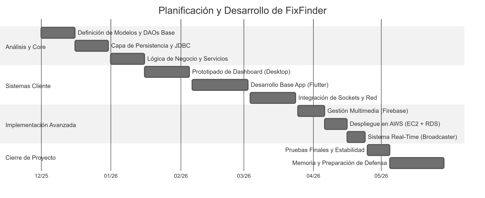

---

## 3.3. Casos de uso

#### Descripción de los casos de uso

En FixFinder cada uno tiene su papel: el **cliente** es quien pone la rueda en marcha, el **gerente** es el director de orquesta que organiza y presupuesta, y el **operario** es quien soluciona el problema sobre el terreno. Todos están conectados para que la información fluya sin interrupciones.

**Actores principales:**

- **Cliente:** Usuario final que demanda servicios de mantenimiento.
- **Operario:** Técnico especialista encargado de ejecutar las reparaciones.
- **Gerente:** Supervisor de operaciones y responsable de gestión de la empresa.

#### Diagrama de Casos de Uso (UML)

> _Este diagrama muestra los actores del sistema y sus interacciones con las funcionalidades principales, siguiendo la notación UML estándar._

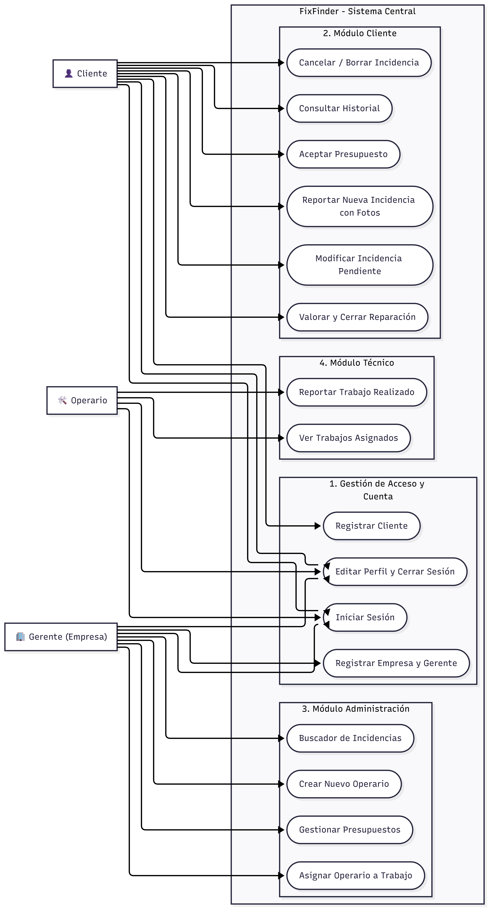

---

#### Diagrama de Flujo de Casos de Uso

> _Este diagrama representa el flujo completo de un proceso de incidencia, siguiendo la línea mas gruesa del diagrama, desde la creación por el cliente hasta el cierre y valoración, mostrando las transiciones de estado y los actores involucrados en cada paso._

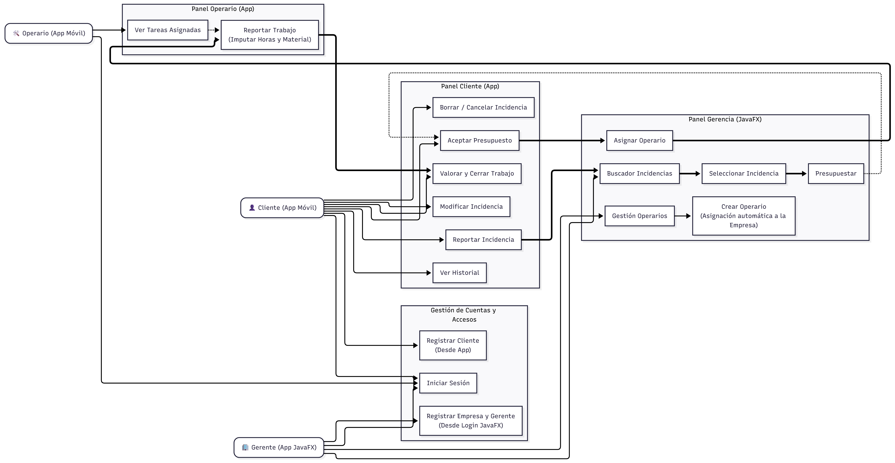

---

## 3.4. Diagrama de clases inicial

#### Descripción de las clases (diseño inicial)

Desde el principio tuve claro que la estructura debía ser sólida. Empecé con un diseño de clases sencillo donde todo gira alrededor del `Trabajo` (la avería). Quería que la herencia entre usuarios fuera limpia y que cada paso, desde el presupuesto hasta el pago final, quedara atado para no dejar cabos sueltos en la base de datos.

#### Diagrama de Clases Simplificado (Inicial)

> _Visión simplificada del modelo de clases que sirvió de punto de partida para el desarrollo, mostrando las relaciones de herencia y asociación entre las entidades principales._

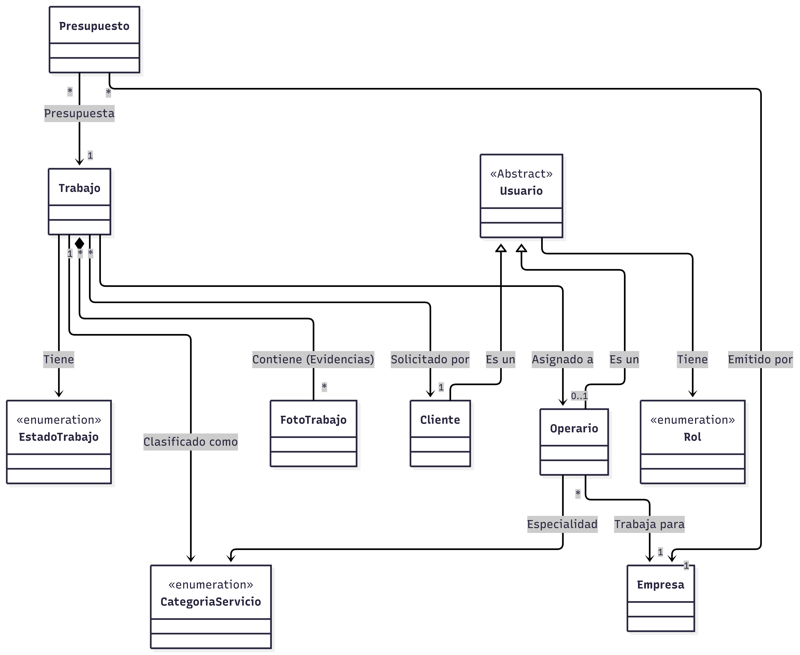

---

#### Diagrama Entidad-Relación

> _Modelo relacional de la base de datos, mostrando todas las tablas, sus atributos principales y las relaciones (claves primarias y foráneas) entre ellas._

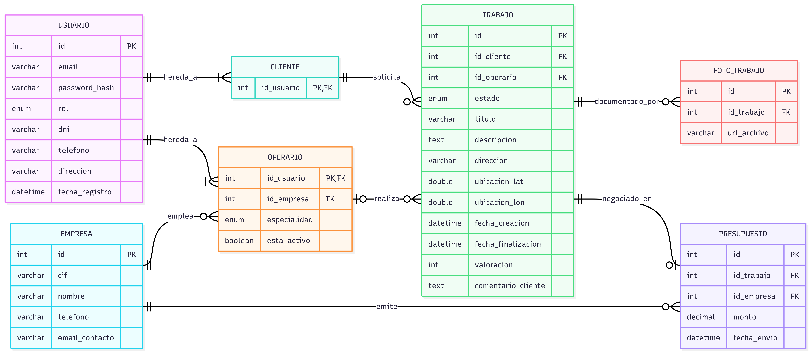

---

## 3.6. Otros diagramas y descripciones

Hasta yo mismo durante le desarrollo me he perdido en el flujo de datos, por lo que este diagrama es fundamental para entender el sistema. Desde que se crea la incidencia, pasa por el gerente que presupuesta, vuelve al cliente que la acepta, el gerente asigna operario, este finaliza la reparación, el cliente envia valoración, y mientras tanto el sistema trata y modifica todos los datos, el flujo puede perderse en cualquier momento.

#### Diagrama de Flujo Completo del Sistema

> _Representa el ciclo de vida completo de una incidencia en FixFinder, desde que el cliente la reporta hasta que se cierra._


---

# 4. Diseño del proyecto

## 4.1. Arquitectura del sistema

#### Descripción de la arquitectura

_marca_

Como he mencionado antes, la arquitectura es de alto nivel sin usar frameworks, pero si patrones de diseño perfectamente ajustados como la conexión cliente-servidor mediante sockets TCP, cada conexión es un hilo que se asocian de forma permanente durante la sesión (thread-per-client).

Como tenemos una conexión continua, me encontré con problemas de concurrencia, tenemos cada conexión con su hilo, pero cada conexión no tenia control en el envio de datos y colapsaba, tuve que implementar un prefijo de 4 bytes en cada mensaje que indicaba el tamaño del mensaje, de esta forma el receptor sabia cuanto leer y podia procesar los mensajes de forma ordenada.

La gestión de estas peticiones, al ser tan variadas no podiamos tener un solo switch, por lo que implementé un sistema de procesadores, cada uno especializado en un tipo de petición, de esta forma el servidor podia procesar las peticiones de forma ordenada y eficiente.

Para tratar las imagenes y no tener que pelearme con enviar binarios por socket, ya que aprendimos a usar Firebase de Google, decidí usarlo para almacenar y gestionar las imagenes, por lo que la app solo almacena la URL de la imagen.

#### Diagrama de Arquitectura del Backend

> _Este diagrama muestra toda la arquitectura del backend, desde el servidor central que acepta conexiones TCP hasta el acceso a la base de datos MySQL, pasando por los procesadores de cada acción y la capa de servicios de negocio. Tanto el cliente ocmo la app acceden al servidor de la misma forma y el gestor de conexiones se encarga de distribuir las peticiones a los procesadores correspondientes que a su vez decide a que clase de servicio llamar y ejecutar su accion sobre el mismo repositorio de la capa de datos, y este hace la misma funcion que en la capa de datos._

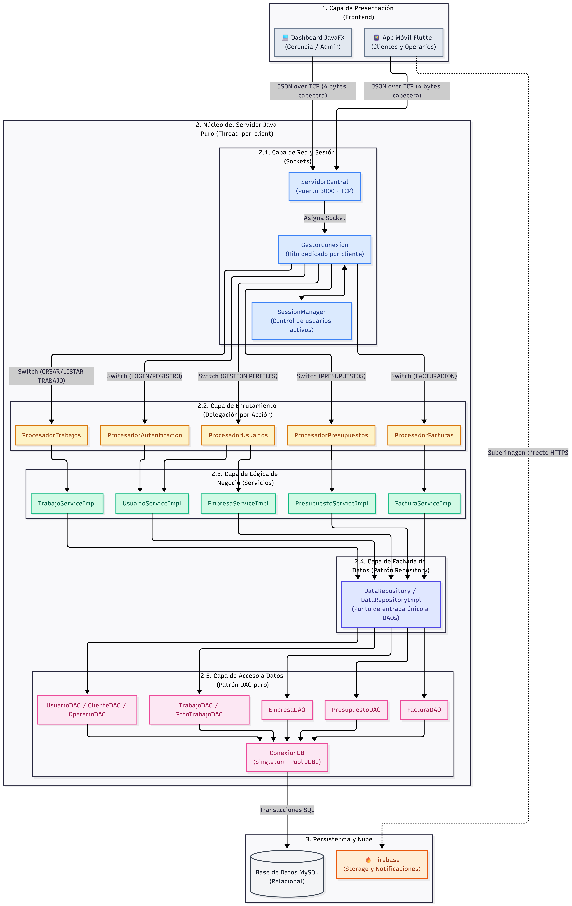

---

#### Diagrama de Componentes de la App Móvil

> _Diagrama de la arquitectura interna de la aplicación Flutter, mostrando la organización en capas: pantallas, servicios, modelos, providers y componentes reutilizables (widgets)._

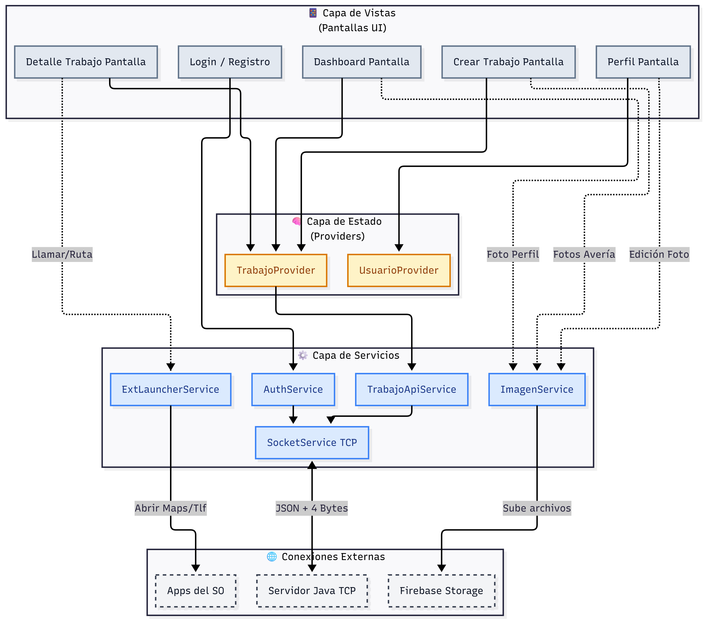

---

#### Diagrama de Despliegue Local

> _Muestra la configuración de red local del sistema durante el desarrollo y las pruebas: el servidor Java corriendo en el PC de desarrollo, conectado a MySQL, y siendo accedido tanto por el Dashboard (misma máquina) como por los emuladores Android y dispositivos físicos en la misma red Wi-Fi._

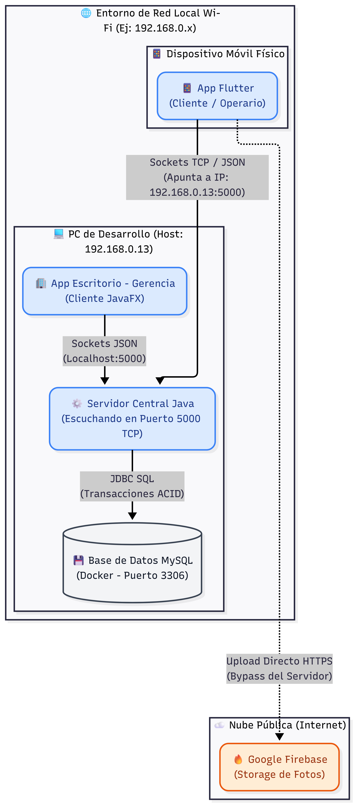

---

#### Diagrama de Despliegue AWS (Producción)

> _Arquitectura de producción planificada en AWS Free Tier: instancia EC2 corriendo el servidor Java en un contenedor Docker, base de datos en RDS MySQL, y comunicación con los clientes a través de una IP elástica pública._

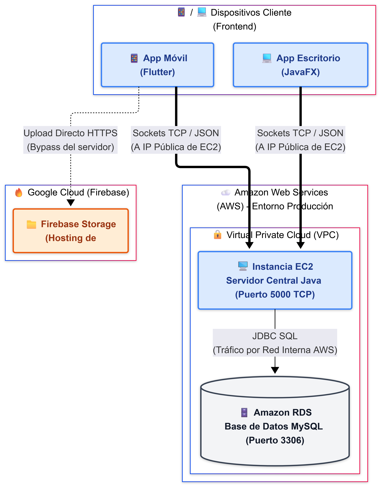

---

## 4.2. Diagrama de clases definitivo

#### Descripción de las clases (diseño final)

He conseguido que cada entidad (como un Trabajo o un Presupuesto) sepa exactamente qué tiene que hacer. La jerarquía de usuarios me permite tratar a todos por igual en la base, pero darles "habilidades" distintas según si eres cliente, operario o gerente. Todo está atado con estados claros que controlan que un trabajo no se salte pasos.

#### Diagrama de Clases Completo (Definitivo)

> _Modelo de clases completo del sistema con todas las relaciones de herencia, composición y asociación entre las capas de Presentación, Servicios, DAO y Modelos del dominio._

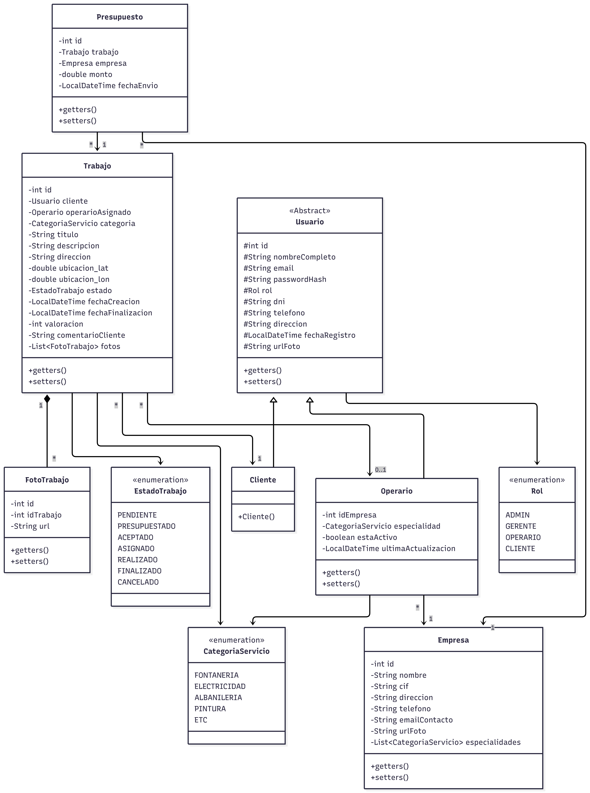

---

## 4.3. Diseño de la interfaz de usuario

Para el diseño de las interfaces me he decantado por un tema **oscuro y elegante** con el **naranja** como énfasis como marca de la aplicación _FF_, paneles simples e intuitivos para el usuario, con un diseño moderno y limpio.

#### Mockups y pantallas principales

---

### Test panel

> 🛠️ **Panel de Pruebas de Desarrollo**
> _El primer panel que creé fue el de pruebas, muy sencillo que nos permitía probar la conexión con el servidor, crear incidencias, verlas, editarlas, valorarlas y eliminarlas al igual que gestionar los usuarios de forma rápida para testear todo el flujo de datos._

|                 Test Conexión                 |               Test Crear               |                 Test Incidencia                  |
| :-------------------------------------------: | :------------------------------------: | :----------------------------------------------: |
| 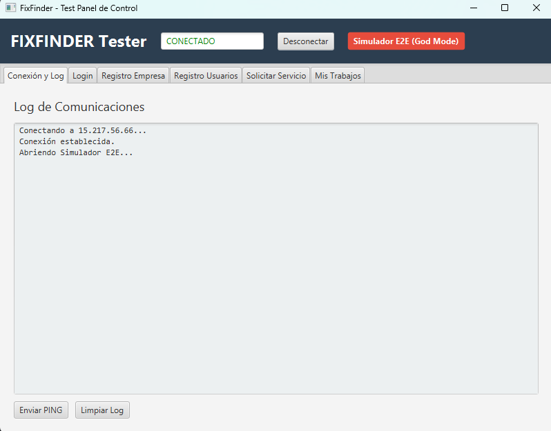 | 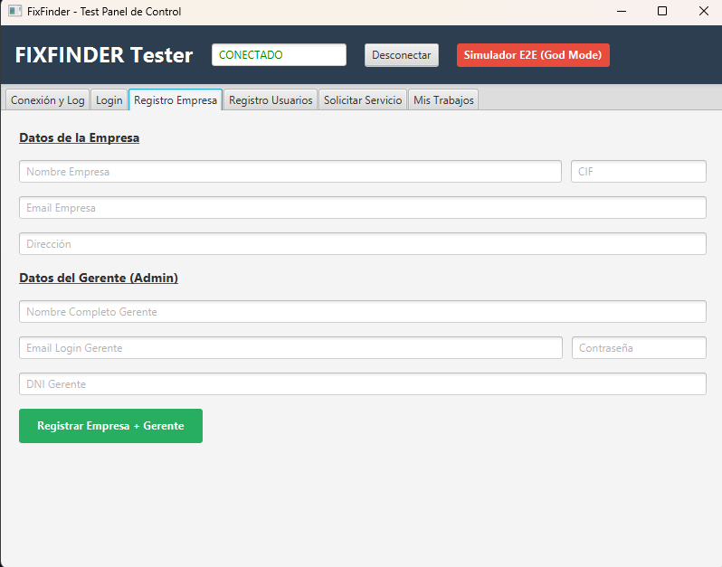 | 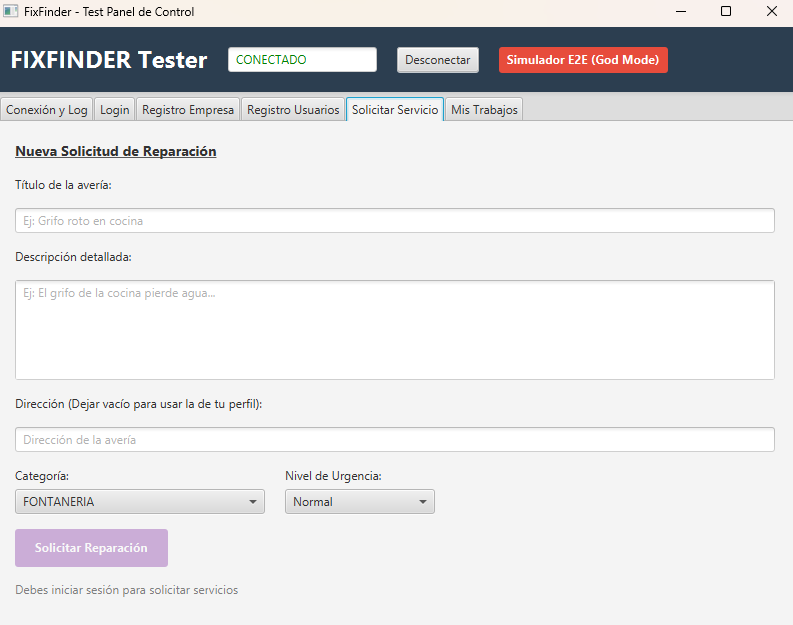 |

<br>

> ⚡ **Simulador (God Mode)**
> _Por ultimo creé el panel "dios" con botones para todo tipo de acciones de cualquier perfil, así comprobar todo el funcionamiento de principio a fin antes de crear las interfaces definitivas de ambas aplicaciones cliente y app._

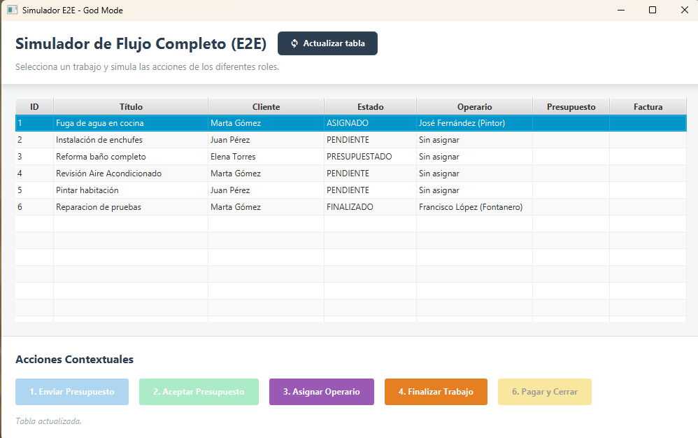

---

### Panel Dashboard

> 🔒 **Acceso Seguro**
> _Panel de entrada para la aplicación de escritorio._

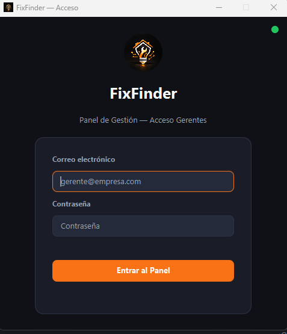

<br>

> 📊 **Centro de Control principal**
> _En el dashboard para las empresas tenemos un panel principal con las métricas de la empresa, un panel de incidencias, un panel de operarios y el apartado de la empresa y su información además de un histórico de operaciones._

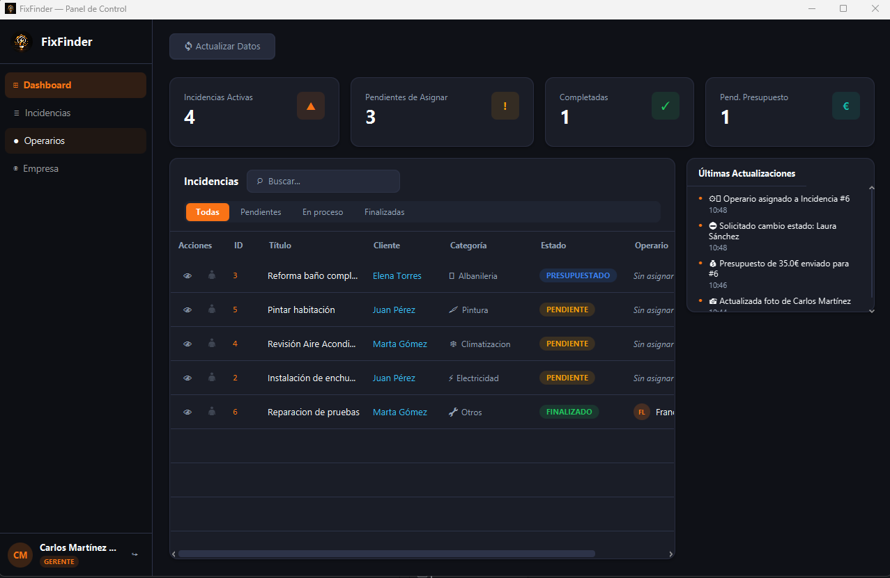

<br>

> 👷 **Gestión de Recursos Humanos**
> _El panel de operarios nos permite tanto crear nuevos operarios como ver y editar nuestros trabajadores, cambiar su foto o ponerlos de baja por cualquier circunstancia._

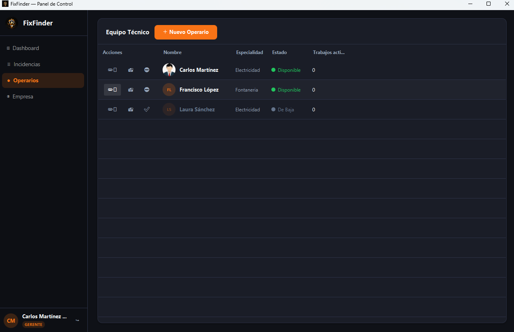

<br>

> 🏢 **Datos Corporativos**
> _En el panel de empresa tenemos todos nuestros datos como empresa y gerente de la misma ademas de un pequeño apartado de las valoraciones de los clientes._

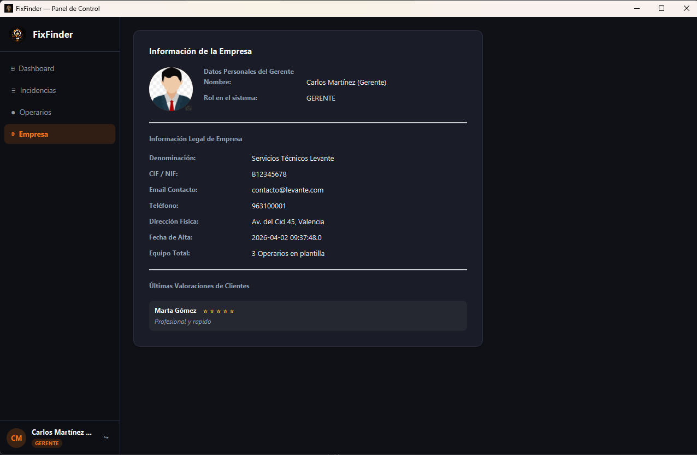

<br>

> 📋 **Control de Incidencias**
> _Tenemos tambien varias tarjetas como la de clientes y esta de incidencias para previsualizar toda la información de cada una._

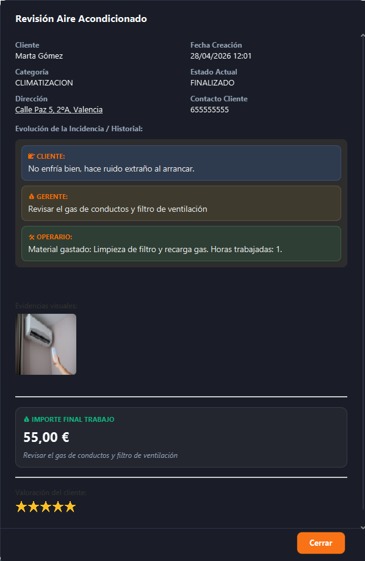

---

### App Móvil (Flutter)

> 📱 **Arquitectura Inteligente**
> _La app es muy sencilla pero inteligente al mismo tiempo, su contenido cambia dependiendo del rol, aun así solo tiene 4 pantallas, la principal donde vemos las tarjetas de nuestras incidencias y su estado actual, la vista de incidencia donde vemos todos los detalles de una incidencia, la vista de perfil donde vemos nuestros datos y un pequeño apartado para valorar a un el trabajo realizado._

|                      Vista Login Móvil                      |              Vista Principal (Cliente)              |
| :---------------------------------------------------------: | :-------------------------------------------------: |
|            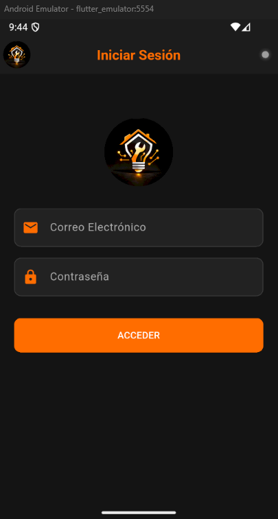             |        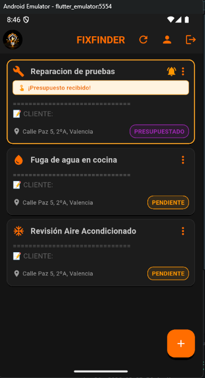         |
|               **Vista Incidencia (Cliente)**                |                  **Vista Perfil**                   |
|       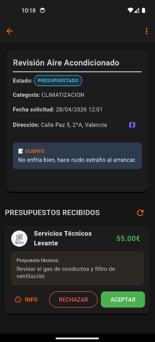        |               |
|                    **Vista Valoración**                     |           **Vista Principal (Operario)**            |
|       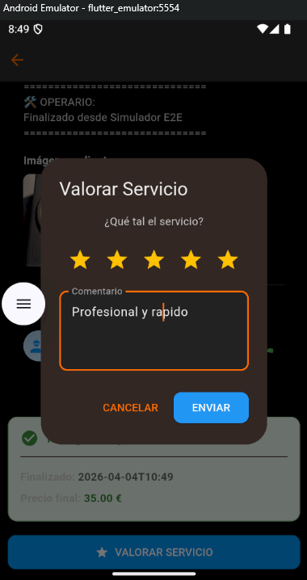        |        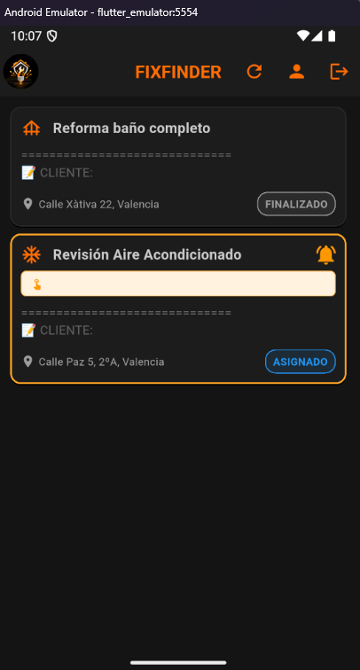        |
|               **Vista Incidencia (Operario)**               |          **Vista Finalización (Operario)**          |
| 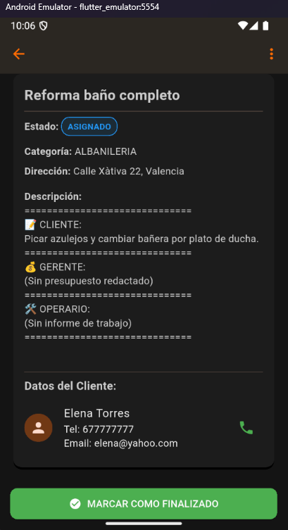 |  |

---

### Infraestructura Cloud

> ☁️ **Monitorización AWS**
> _Por último, como hemos desplegado nuestro servicio en AWS, podemos ver las métricas de nuestro servidor en la consola para controlar su funcionamiento._

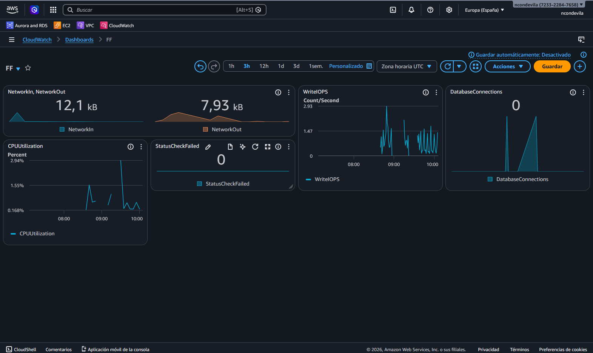

---

#### Diagrama de Navegación de la App Móvil

> _Mapa de navegación completo de la aplicación Flutter, mostrando todas las pantallas disponibles para cada rol (Cliente, Operario) y las transiciones entre ellas._

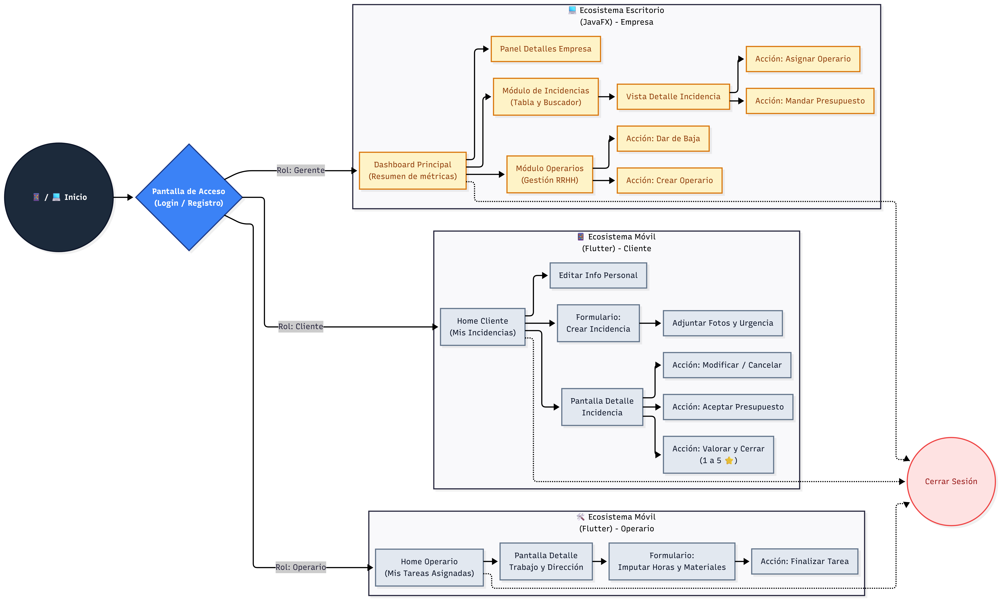

---

## 4.4. Otros diagramas y descripciones

#### Diagrama de Secuencia — Comunicación por Sockets

> _Diagrama de secuencia que ilustra el protocolo de comunicación TCP/JSON entre los clientes (App y Dashboard) y el servidor, incluyendo el handshake de conexión, el formato de los mensajes (cabecera de 4 bytes + JSON) y el ciclo de petición-respuesta._

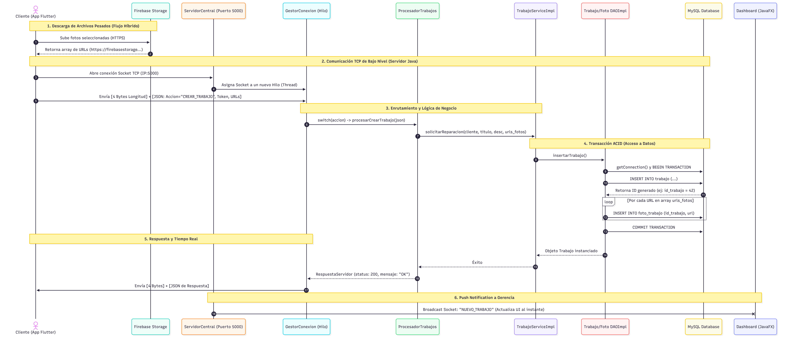

---

# 5. Implementación del proyecto

## 5.1. Estructura del proyecto

El proyecto se organiza en tres grandes bloques desacoplados:

1. **Módulo Central (Java):** Contiene tanto el servidor de sockets como el código compartido de modelos y lógica de negocio.
2. **App Móvil (Flutter):** Proyecto Dart independiente que implementa la lógica de cliente para Android.
3. **Documentación:** Carpeta centralizada con diagramas, esquemas SQL y la memoria técnica.

```
FF/
├── FIXFINDER/            # Módulo Java (Servidor + Dashboard Tester)
│   └── src/main/java/com/fixfinder/
│       ├── cliente/      # ServicioCliente, ClienteSocket
│       ├── controladores/# DashboardController, SimuladorController
│       ├── data/         # DAOs, DataRepository
│       ├── modelos/      # Usuario, Cliente, Operario, Trabajo, Empresa...
│       ├── red/          # ServidorCentral, GestorConexion, Procesadores
│       ├── service/      # Servicios de negocio (UsuarioService, etc.)
│       ├── ui/dashboard/ # AppDashboardPrincipal, DashboardPrincipal...
│       └── utilidades/   # SessionManager, GestorPassword, etc.
├── fixfinder_app/        # Módulo Flutter (App Móvil)
│   └── lib/
│       ├── models/       # usuario.dart, trabajo.dart, etc.
│       ├── providers/    # trabajo_provider.dart
│       ├── screens/      # login, dashboard, perfil, detalle_trabajo...
│       ├── services/     # auth_service.dart, socket_service.dart...
│       └── widgets/      # Componentes reutilizables
└── DOCS/                 # Documentación y diagramas
    └── diagramas/        # Imágenes PNG + código Mermaid TXT
```

### Arquitectura de despliegue en producción (AWS)

Para el despliegue en producción, el sistema está planificado sobre la capa gratuita de **Amazon Web Services (AWS Free Tier)**:

| Componente                   | Servicio AWS                    | Descripción                                                                                                                                                          |
| ---------------------------- | ------------------------------- | -------------------------------------------------------------------------------------------------------------------------------------------------------------------- |
| **Servidor de aplicaciones** | **EC2** (`t3.micro`)            | Instancia Linux con Docker que ejecuta el servidor Java (Socket Server en puerto 5000). Se conecta a RDS para persistencia. IP elástica pública para acceso externo. |
| **Base de datos**            | **RDS** (`db.t3.micro` MySQL 8) | Instancia MySQL gestionada por AWS. Accesible desde EC2 vía endpoint interno. Separada del servidor para mayor seguridad y escalabilidad.                            |
| **Almacenamiento de media**  | **Firebase Storage**            | Las imágenes de perfil y fotos de trabajo se suben directamente desde los clientes (App Flutter) a Firebase, sin pasar por EC2.                                      |
| **Clientes**                 | App Flutter + Dashboard JavaFX  | Se conectan directamente a la IP elástica de EC2 en el puerto 5000 mediante sockets TCP.                                                                             |

```
╔═══════════════════════════ AWS Free Tier ═══════╗
║                                                 ║
║  ┌─────────────────┐     ┌─────────────────┐    ║
║  │  EC2 (t3.micro)  │►───►│ RDS MySQL 8    │    ║
║  │  Docker + Java  │     │ (db.t3.micro)   │    ║
║  │  Puerto :5000   │     │  Puerto :3306   │    ║
║  └─────────────────┘     └─────────────────┘    ║
║           ▲                                     ║
╚═══════════◊═════════════════════════════════════╝
            │ TCP :5000
  ┌─────────┴──────────┐
  │  Clientes          │
  │ App Flutter        │─────► Firebase Storage
  │ Dashboard JavaFX   │     (Imágenes)
  └───────────────────┘
```

> [Describe aquí los módulos principales del sistema y su función. Puedes estructurarlo en tres bloques: Servidor Java, Dashboard JavaFX y App Flutter.]

#### Servidor Java (Backend)

Actúa como el cerebro del sistema. Implementa la persistencia mediante DAOs y gestiona la comunicación bidireccional con los clientes mediante el protocolo de 4 bytes + JSON. Su arquitectura de procesadores permite una gran extensibilidad.

#### Dashboard de Escritorio (JavaFX)

Interfaz de alta productividad para el gerente. Se comunica con el servidor para la gestión masiva de incidencias, creación de presupuestos y administración de usuarios, integrando un simulador de estados para pruebas E2E.

#### Aplicación Móvil (Flutter)

Orientada a la movilidad de clientes y operarios. Gestiona fotos con Firebase Storage y utiliza un sistema de proveedores (Provider) para mantener la UI sincronizada con los mensajes asíncronos recibidos por el socket.

---

## 5.2. Descripción de los módulos y componentes principales

> [Describe aquí los módulos principales del sistema y su función. Puedes estructurarlo en tres bloques: Servidor Java, Dashboard JavaFX y App Flutter.]

#### Servidor Java (Backend)

> [Describe los componentes clave del servidor: `ServidorCentral`, `GestorConexion`, los `Procesadores` de cada acción, la capa de `Servicios`, los `DAOs` y el `DataRepository`. Menciona el patrón Thread-per-client y el protocolo JSON.]

#### Dashboard de Escritorio (JavaFX)

> [Describe el dashboard: acceso por roles (Gerente/Admin), gestión de incidencias, gestión de operarios, registro de empresas/usuarios, el simulador E2E, etc.]

#### Aplicación Móvil (Flutter)

> [Describe la app móvil: roles (Cliente y Operario), pantallas principales, comunicación via Sockets, gestión de fotos con Firebase Storage, notificaciones, etc.]

---

## 5.3. Despliegue de la aplicación

Aunque durante las pruebas nos hemos movido cómodamente en **local**, FixFinder está diseñado para volar en la **nube**. El salto a **AWS** no es solo por estética tecnológica; es lo que permite que el sistema sea real, accesible desde cualquier red y capaz de aguantar el ritmo de una empresa de verdad. El entorno local ha sido nuestro laboratorio, pero AWS es el mundo real.

---

## 5.4. Capturas de pantalla y ejemplos de código

No hay mejor forma de ver cómo funciona FixFinder que con imágenes reales. Aquí se puede ver el servidor procesando peticiones, el gerente organizando el trabajo y la app móvil lista para la acción. Es el resultado de meses de trabajo resumido en pantallas funcionales.

> **Nota:** Los fragmentos de código relevantes se encuentran en el Anexo A (código fuente completo).

---

# 6. Estudio de los resultados obtenidos

## 6.1. Evaluación del proyecto respecto a los objetivos iniciales

Haciendo balance, FixFinder ha superado lo que imaginamos al principio. El flujo de trabajo funciona como un reloj: desde que el cliente pulsa "enviar" hasta que el operario marca como "terminado". Hemos conseguido integrar tres plataformas distintas con un protocolo propio, algo que parecía un mundo al empezar. Aunque siempre se puede mejorar (¡nunca se termina de programar del todo!), la base es sólida, profesional y cumple con todos los objetivos técnicos que nos marcamos.

---

## 6.2. Problemas encontrados y soluciones aplicadas

No voy a mentir: ha habido momentos difíciles. Sincronizar los hilos para que la pantalla no se quedara congelada mientras el servidor pensaba fue un reto (lo solucionamos con `Platform.runLater` y `Futures`), y entenderse con los sockets byte a byte nos llevó más tiempo de lo esperado (el protocolo de 4 bytes fue la clave). Pero cada problema ha servido para que el sistema sea hoy mucho más robusto.

| Problema                    | Solución aplicada                                                       |
| --------------------------- | ----------------------------------------------------------------------- |
| Congelación de UI por red   | Desplazamiento de tareas a hilos secundarios y actualización asíncrona. |
| Corrupción de mensajes JSON | Implementación de cabecera de 4 bytes para prefijo de longitud.         |
| Carga lenta de imágenes     | Integración de Firebase Storage con carga directa vía URL.              |
| Desconexiones inesperadas   | Sistema de reconexión automática en el cliente (SocketService).         |

---

## 6.3. Futuras mejoras y ampliaciones

FixFinder es solo el principio. Lo siguiente sería añadir notificaciones "push" reales que te avisen al móvil al momento, un chat integrado para no depender de llamadas externas y, por qué no, una versión web para que el gerente pueda trabajar desde cualquier navegador sin instalar nada. El sistema está preparado para crecer.

- [ ] Notificaciones Push nativas.
- [ ] Sistema de Chat interno Cliente-Operario.
- [ ] Dashboard administrativo en formato Web.
- [ ] Generación automática de facturas en PDF.

---

# 7. Conclusiones

## 7.1. Relación con los contenidos de los módulos

Este proyecto ha sido el examen final perfecto. He tenido que poner en práctica todo lo aprendido en clase: desde cómo conectar una base de datos segura (Acceso a Datos) hasta cómo diseñar una interfaz que no confunda al usuario (DI y PMDM), pasando por la gestión de servidores y procesos en tiempo real (PSP y SGE). FixFinder no es solo código; es la suma de todo lo aprendido en estos dos años.

---

## 7.2. Valoración personal del proyecto

Personalmente, FixFinder ha sido un reto increíble que me ha hecho crecer como programador. Me ha servido para darme cuenta de que lo más difícil no es escribir código, sino planificar cómo se van a hablar todas las partes de un sistema tan grande. Me voy con la satisfacción de haber creado algo que funciona de verdad, que resuelve un problema real y con muchas ganas de seguir puliendo el sistema. Ha sido, sin duda, la mejor forma de cerrar esta etapa.

---

# 8. Bibliografía y recursos utilizados

- [Documentación oficial de JavaFX — openjfx.io](https://openjfx.io/)
- [Documentación oficial de Flutter — flutter.dev](https://flutter.dev/docs)
- [Firebase Documentation — firebase.google.com](https://firebase.google.com/docs)
- [MySQL 8.0 Reference Manual — dev.mysql.com](https://dev.mysql.com/doc/)
- [Jackson Databind Documentation — FasterXML](https://github.com/FasterXML/jackson-databind)
- [AWS Free Tier Documentation — aws.amazon.com](https://aws.amazon.com/free/)
- [Escribe aquí otros recursos consultados...]

---

# 9. Anexos

### Anexo A — Código Fuente

Anexo A — Código Fuente completa.

### Anexo B — Guía de Instalación y Configuración

> [Referencia o texto de la guía de instalación del sistema: requisitos previos (JDK 21, Flutter, MySQL 8, Firebase), pasos de configuración de la base de datos (SCHEMA.sql), variables de configuración (puerto, host, credenciales), arranque del servidor y de los clientes.]

### Anexo C — Esquema de Base de Datos

> [Referencia al script SQL de creación del esquema de la base de datos (`SCHEMA.sql` o equivalente), incluyendo la creación de todas las tablas, índices y relaciones.]

### Anexo D — Códigos Mermaid de los Diagramas

Los ficheros `.txt` con el código fuente completo de todos los diagramas se encuentran en la carpeta `DOCS/diagramas/`:

| Fichero                           | Diagrama                                  |
| --------------------------------- | ----------------------------------------- |
| `diagrama_backend.txt`            | Arquitectura del Backend por capas        |
| `diagrama_casos_de_uso_UML.txt`   | Casos de uso UML                          |
| `diagrama_casos_de_uso_FLUJO.txt` | Flujo de casos de uso                     |
| `diagrama_clases_completo.txt`    | Diagrama de clases completo (definitivo)  |
| `diagrama_clases_simple.txt`      | Diagrama de clases simplificado (inicial) |
| `diagrama_componentes_app.txt`    | Componentes de la app Flutter             |
| `diagrama_despliege_aws.txt`      | Despliegue en AWS (producción)            |
| `diagrama_despliegue_local.txt`   | Despliegue local (desarrollo)             |
| `diagrama_entidad_relacion.txt`   | Entidad-Relación de la base de datos      |
| `diagrama_flujo_completo.txt`     | Flujo completo del sistema                |
| `diagrama_navegacion.txt`         | Navegación de la app móvil                |
| `diagrama_secuencia_sockets.txt`  | Secuencia de comunicación por sockets     |

---

_Documento generado en Markdown — preparado para conversión a PDF._  
_Última actualización: marzo 2026._
