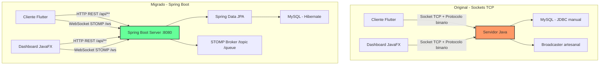
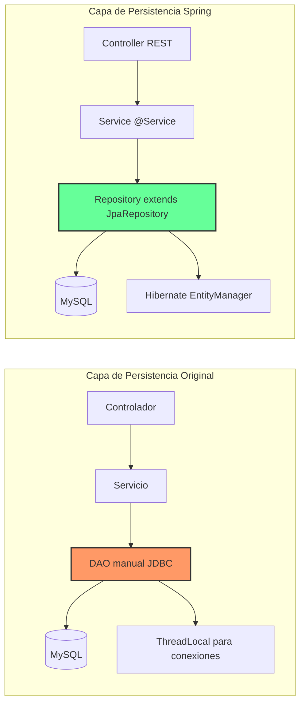
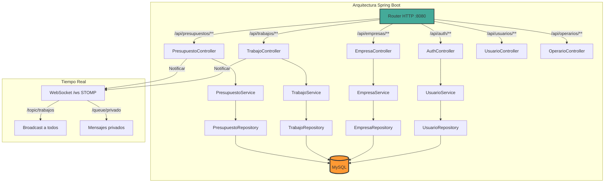

# Anexo: Migración a Spring Boot

## ¿Por qué Spring Boot?

La arquitectura original de FixFinder, basada en sockets TCP puros con protocolo binario artesanal, demostró ser una solución sólida y de gran aprendizaje. Sin embargo, a medida que el sistema crecía, se hizo evidente la necesidad de un framework que ofreciera:

- **Estandarización de endpoints** mediante una API REST bien definida.
- **Gestión automática de la persistencia** con un ORM maduro.
- **Simplificación del despliegue** gracias a la configuración por perfiles y el empaquetado en un solo JAR.
- **Ecosistema de herramientas** para seguridad, validación, pruebas y documentación.

## ¿Qué se ha migrado?

### 1. Comunicación: De Sockets TCP a API REST + WebSockets

**Antes (original):** El cliente y el servidor se comunicaban mediante un protocolo binario propio sobre sockets TCP. Cada mensaje llevaba una cabecera de 4 bytes (Big-Endian) con la longitud del payload JSON, y se utilizaban IDs de transacción (txid) para correlacionar peticiones y respuestas asíncronas. La concurrencia se gestionaba manualmente con un modelo **Dispatcher-Worker** y un **Broadcaster** para notificaciones push.

**Ahora (Spring Boot):** Los clientes se comunican con el servidor mediante **HTTP REST** para las operaciones CRUD, y mediante **WebSockets con STOMP** para las notificaciones en tiempo real. Esto elimina la complejidad del protocolo binario, simplifica la depuración y permite que cualquier cliente HTTP (navegador, Postman, script) pueda interactuar con el sistema.



### 2. Persistencia: De DAOs manuales a Spring Data JPA

**Antes:** Cada entidad tenía un DAO propio que ejecutaba consultas SQL mediante JDBC. La conexión se gestionaba con `ThreadLocal` para aislar las transacciones de cada hilo de trabajo.

**Ahora:** Spring Data JPA gestiona automáticamente las conexiones, las transacciones y el mapeo objeto-relacional. Basta con definir interfaces que extienden `JpaRepository` para tener operaciones CRUD completas, consultas personalizadas y paginación.



### 3. Arquitectura general del sistema migrado

La nueva arquitectura sigue el patrón clásico de **Spring Boot en tres capas**:

- **Controlador REST** → Recibe peticiones HTTP, delega en servicios, devuelve JSON.
- **Servicio** → Contiene la lógica de negocio, anotada con `@Service` y `@Transactional`.
- **Repositorio** → Capa de acceso a datos, extiende `JpaRepository`.

Las notificaciones en tiempo real (antes gestionadas por el `Broadcaster` artesanal) ahora se realizan mediante **WebSockets STOMP**, con un broker simple que difunde mensajes a los tópicos `/topic` (broadcast) y `/queue` (mensajes privados).



### 4. Configuración por perfiles

Spring Boot permite definir perfiles de configuración para diferentes entornos. FixFinder ahora utiliza dos perfiles:

| Perfil   | Base de datos                     | Uso               |
|----------|-----------------------------------|-------------------|
| `local`  | MySQL en `localhost:3306`         | Desarrollo local  |
| `cloud`  | AWS RDS (MySQL gestionado)        | Producción        |

El perfil activo se selecciona mediante `spring.profiles.active=local` o `spring.profiles.active=cloud` en `application.yml`, eliminando la necesidad de cambiar manualmente las conexiones.

### 5. Dependencias principales del nuevo build

```gradle
dependencies {
    implementation 'org.springframework.boot:spring-boot-starter-web'        // API REST
    implementation 'org.springframework.boot:spring-boot-starter-data-jpa'   // JPA + Hibernate
    implementation 'org.springframework.boot:spring-boot-starter-websocket'  // WebSockets STOMP
    implementation 'org.springframework.boot:spring-boot-starter-validation' // Validación
    runtimeOnly     'com.mysql:mysql-connector-j'                            // Driver MySQL
    implementation 'com.google.firebase:firebase-admin:9.2.0'                // Firebase Storage
}
```

## ¿Qué se conserva?

- **Los modelos de datos** (entidades Java) se mantienen, ahora anotados con `@Entity`, `@Table`, etc.
- **Firebase Storage** sigue siendo el sistema de almacenamiento de imágenes, ya que funciona independientemente del framework.
- **La lógica de negocio** se traslada intacta a los nuevos `@Service`, adaptando las firmas de los métodos.
- **El Dashboard JavaFX y la App Flutter** siguen siendo los mismos clientes, solo que ahora se comunican mediante HTTP REST + WebSockets en lugar de sockets TCP directos.

## Resumen del cambio

| Aspecto               | Original (Sockets TCP)                       | Migrado (Spring Boot)                       |
|-----------------------|----------------------------------------------|---------------------------------------------|
| Comunicación          | Sockets TCP + protocolo binario (4 bytes)    | HTTP REST + WebSockets STOMP                |
| Persistencia          | DAOs manuales con JDBC + ThreadLocal         | Spring Data JPA (JpaRepository)             |
| Concurrencia          | Dispatcher-Worker + hilos manuales           | Gestionada por Tomcat + Spring              |
| Tiempo real           | Broadcaster artesanal (Observer)             | STOMP Broker (/topic, /queue)               |
| Configuración         | Constantes hardcodeadas                      | application.yml con perfiles                |
| Validación            | Manual en cada procesador                    | `@Valid` + anotaciones Jakarta              |
| Despliegue            | JAR + script manual con variables de entorno | fat JAR con perfil activo (`--spring.profiles.active=cloud`) |