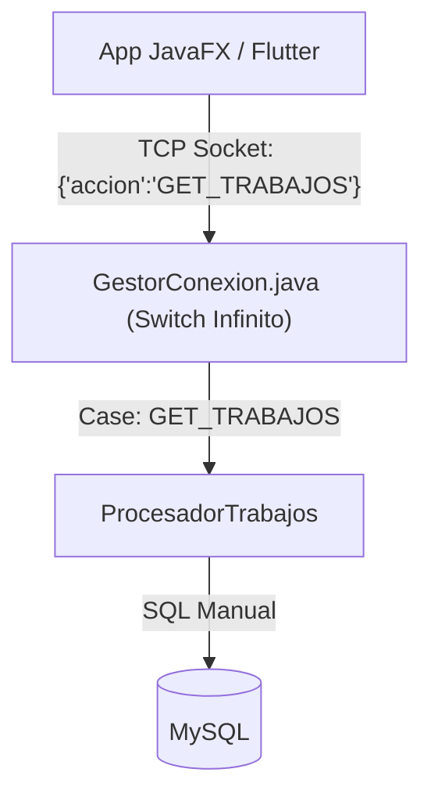
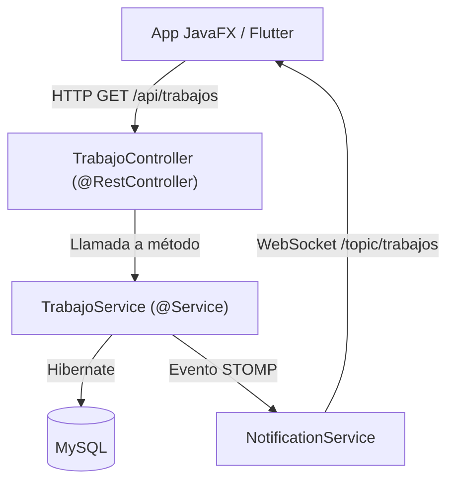

# Tesis de Migración: De Arquitectura Manual a Spring Boot y Hibernate

Este documento constituye la memoria técnica detallada de la reestructuración arquitectónica del sistema FixFinder. A continuación, se expone un análisis exhaustivo del proceso de migración desde un modelo monolítico basado en Sockets TCP crudos hacia una arquitectura empresarial estándar utilizando **Spring Boot** y **Hibernate (JPA)**.

El objetivo de este informe es proporcionar todo el contexto necesario, desde los conceptos fundamentales de los frameworks utilizados hasta el ciclo de vida de una petición HTTP, asegurando que cualquier desarrollador (o el propio autor original) pueda comprender la nueva arquitectura en profundidad.

---

## 1. Fundamentos Tecnológicos: ¿Qué son Spring Boot e Hibernate?

Antes de analizar los cambios de código, es crucial entender por qué estas tecnologías cambian las reglas del juego.

### 1.1. Spring Boot y la Inversión de Control (IoC)
En la versión manual de FixFinder, tú (el desarrollador) tenías el control absoluto: tú instanciabas los objetos (`new ProcesadorUsuarios()`), tú abrías los hilos (`new Thread()`), y tú gestionabas los puertos.
Spring Boot invierte este paradigma a través de la **Inversión de Control (IoC)**. Ahora, Spring es el contenedor principal que arranca la aplicación. Él se encarga de instanciar las clases, gestionar los puertos (a través del servidor Tomcat embebido), y proporcionar las dependencias a las clases que las necesitan (Inyección de Dependencias). 

### 1.2. Hibernate y JPA (Java Persistence API)
En la versión original, la capa de acceso a datos (los DAOs) estaba plagada de lenguaje SQL manual y sentencias `PreparedStatement` o `ResultSet`. Esto era propenso a errores tipográficos, inyecciones SQL y un código extremadamente repetitivo.
**JPA** es un estándar de Java que define cómo mapear objetos Java (POJOs) directamente a tablas relacionales de base de datos. **Hibernate** es la herramienta (el motor) que hace ese trabajo en la sombra. Gracias al **ORM (Object Relational Mapping)**, ya no pensamos en "Filas y Columnas", sino puramente en "Objetos de Java".

---

## 2. Diccionario de Anotaciones (Las Etiquetas)

El ecosistema Spring se comunica a través de **anotaciones** (las palabras que empiezan por `@`). Ellas configuran el comportamiento de las clases sin escribir código imperativo.

### Capa de Control (Web y Enrutamiento)
*   `@RestController`: Indica a Spring que esta clase actuará como un receptor de peticiones de red (un endpoint HTTP). Todo lo que devuelvan sus métodos será serializado automáticamente a texto JSON y enviado al cliente.
*   `@RequestMapping("/ruta")`: Define el prefijo base de URL para toda una clase. Si se pone `@RequestMapping("/api/usuarios")` sobre la clase, todas sus funciones internas colgarán de ahí.
*   `@GetMapping` / `@PostMapping` / `@PutMapping` / `@DeleteMapping`: Estas etiquetas se ponen sobre los métodos individuales y los vinculan a un verbo HTTP específico. 
    *   *¿Cómo se une el string?* Si la clase tiene `@RequestMapping("/api/usuarios")` y el método tiene `@GetMapping("/{id}")`, Spring sabe que cuando el servidor reciba la petición HTTP `GET /api/usuarios/5`, debe ejecutar ese método pasando un `5` en la variable `id`.

### Capa de Lógica y Datos
*   `@Service`: Marca una clase como parte de la capa de lógica de negocio. Le dice a Spring: "Crea un único objeto (Singleton) de esta clase al arrancar, lo voy a necesitar en varios sitios".
*   `@Autowired`: Es la magia de la Inyección de Dependencias. En lugar de hacer `this.usuarioService = new UsuarioServiceImpl();`, ponemos `@Autowired` sobre la variable y Spring busca automáticamente la clase correspondiente y se la inyecta.
*   `@Transactional`: Crucial en bases de datos. Si un método anota esta etiqueta, todas las operaciones de guardado que haga se ejecutarán en una misma "caja atómica" (Transacción). Si el método da error a la mitad, Hibernate hace un *rollback* y anula cualquier guardado a medias en MySQL, evitando datos corruptos.

### Capa de Entidades (JPA)
*   `@Entity`: Le dice a Hibernate: "Esta clase Java representa una tabla entera en MySQL".
*   `@Table(name="usuarios")`: (Opcional) Fuerza a que la tabla en la BD se llame de una manera específica.
*   `@Id` y `@GeneratedValue`: Le indican cuál es la Clave Primaria y que MySQL la autoincrementará.
*   `@ManyToOne` / `@OneToMany`: Le explican a Hibernate cómo se relacionan las tablas entre sí, para que él construya los comandos `JOIN` de SQL por detrás sin que lo veamos.

---

## 3. Topología de Red: Sockets vs HTTP + STOMP

### El Problema de la Arquitectura Manual
La arquitectura original dependía de un embudo centralizado (`GestorConexion`). El cliente enviaba un String JSON que mezclaba dos mundos: las peticiones síncronas ("dame los datos") y las notificaciones en tiempo real ("ha llegado un mensaje").
Este servidor mantenía un hilo activo `Thread` por cada usuario conectado, consumiendo mucha memoria RAM. El `switch(accion)` infinito era insostenible a largo plazo.

### La Solución de Spring
Hemos bifurcado el tráfico:
1.  **Tráfico de Estado (REST):** Las operaciones CRUD (Crear, Leer, Actualizar, Borrar) usan peticiones **HTTP** puras sin estado. El servidor recibe la petición, responde JSON y cierra la conexión inmediatamente liberando memoria (stateless).
2.  **Tráfico de Eventos (STOMP WebSockets):** Solo mantenemos una conexión abierta (Socket bidireccional) para cuando el servidor necesita empujar información al cliente de improviso (Push notifications). STOMP es el protocolo de mensajería estándar para evitar manejar sockets crudos.

#### Flujos Comparativos

**Antiguo Flujo TCP:**

**Nuevo Flujo REST/STOMP:**

---

## 4. Radiografía Comparativa: Carpeta por Carpeta

### 4.1. De `GestorConexion` a `controller/`
*   **Antes:** Tenías un solo archivo gigante, propenso a cuellos de botella y errores cruzados (tocar un módulo rompía los demás).
*   **Ahora:** Tenemos varios controladores segmentados (`AuthController`, `EmpresaController`, etc.). La ruta (ej. `/api/auth/login`) delega directamente a un bloque de código aislado.

### 4.2. De `Procesadores` a `service/`
*   **Antes:** Tenías las clases `Procesador...`. A veces las llamabas `Servicios` en el cliente. Había una mezcla de nomenclatura.
*   **Ahora:** El estándar exige usar el nombre **Service** para todo lo que contenga reglas de negocio. Esta capa orquesta validaciones, llamadas a repositorios e invocaciones a notificaciones. 
*   **¿Se mantienen las utilidades?** Absolutamente. Las clases utilitarias personalizadas siguen existiendo y siendo llamadas desde los Services.
    *   Por ejemplo, `ServiceException`: Hemos conservado esta clase (que tú ideaste) para manejar errores de negocio de forma unificada en todo el proyecto.
    *   También se mantiene `GestorPassword` (para cifrados hash), y las comprobaciones de lógica de dominio (como que un DNI no sea corto) siguen siendo validadas explícitamente en el `ServiceImpl`.

### 4.3. De `DAOs` y SQL a `repository/`
Esta es la limpieza de código más drástica.
*   **Antes:** Decenas de clases con métodos llenos de `String query = "SELECT * FROM..."`.
*   **Ahora:** Interfaces vacías que heredan de `JpaRepository<Entidad, TipoID>`.
*   **¿Cómo sabe qué buscar el método `findByEmpresaId(int empresaId)` sin tener código dentro?**
    Aquí radica la genialidad de Spring Data JPA (Inferencia de Nombres). Spring escanea el nombre del método en tiempo de compilación. Cuando lee `findBy` (Buscar Por) + `EmpresaId` (Propiedad `empresa` > subpropiedad `id`), automáticamente infiere que la intención es filtrar por esa columna numérica. Spring genera el código SQL subyacente y lo inyecta en memoria al arrancar. Funciona como magia estructurada, requiriendo que los nombres de variables en la Entidad Java coincidan perfectamente con el nombre del método.

### 4.4. El Motor de Tiempo Real (`NotificationService`)
En la versión original, tenías una clase estática `Broadcaster` que iteraba manualmente sobre una lista de Sockets para hacer `output.writeUTF(...)`.
*   **Ahora:** Usamos `NotificationService`. El broker interno de Spring Boot maneja a los usuarios suscritos en memoria de forma optimizada.
*   **¿Qué es el método `crearPayload()`?**
    Cuando el servidor tiene que emitir un evento (ej. "Perfil Modificado"), necesita enviar al cliente una estructura clara para que el frontend la lea (un mapa JSON). En lugar de construir este mapa repetitivamente en cada método ensuciando el código del servicio principal, `crearPayload` es una función auxiliar (*helper*) privada de `NotificationService`. Toma los parámetros básicos (id, nombre, teléfono) y devuelve un `Map<String, Object>` estandarizado que se convertirá en JSON antes de salir por el Socket de STOMP.

---

## 5. La Adaptación del Frontend (`cliente/` de JavaFX)

Reestructurar todo el servidor implicaba que las aplicaciones cliente también debían cambiar su forma de pedir las cosas. Mientras que la app móvil se beneficia enormemente del REST, el Dashboard en JavaFX estaba construido alrededor del antiguo `ClienteSocket`. Para no reescribir 20 ventanas de interfaz gráfica, aplicamos el patrón de diseño "Adaptador".

1.  **`ServicioCliente.java` (El Nuevo Core):** Es la clase que realmente sabe cómo hacer peticiones HTTP y conectarse al WebSockets STOMP de Spring. 
2.  **`ClienteSocket.java` (La Fachada Legacy):** Aún existe, pero ya no abre Sockets TCP. Cuando los botones de tu interfaz JavaFX llaman a sus métodos, este se da la vuelta y se los pide a `ServicioCliente` usando HTTP. De esta forma, el Dashboard no se enteró del cambio de arquitectura subyacente.
3.  **El Código Muerto Eliminado (`UsuarioServiceCliente.java`):** Durante las primeras fases de la migración manual, intentamos crear clases cliente por cada entidad. Finalmente, centralizar las llamadas en `ServicioCliente` fue más eficiente. La clase `UsuarioServiceCliente` quedó obsoleta, inutilizada, y en este refactor ha sido eliminada por completo para mantener el proyecto inmaculado.

---

## 6. Conclusión de la Migración

La migración a **Spring Boot** no fue un simple capricho de refactorización, fue el paso necesario de transformar un "Proyecto Académico Monolítico" en un "Producto Enterprise Escalable".

Se ha erradicado la manipulación de red de bajo nivel (TCP Crudo) y la manipulación de base de datos de bajo nivel (JDBC y SQL en crudo), sustituyéndolos por **Controladores REST** y **Repositorios JPA**. El resultado es una base de código drásticamente más corta, testable, auto-documentada mediante anotaciones, y blindada contra vulnerabilidades críticas como las Inyecciones SQL. FixFinder, en su versión actual, cumple rigurosamente con los paradigmas modernos del desarrollo Backend en Java.
