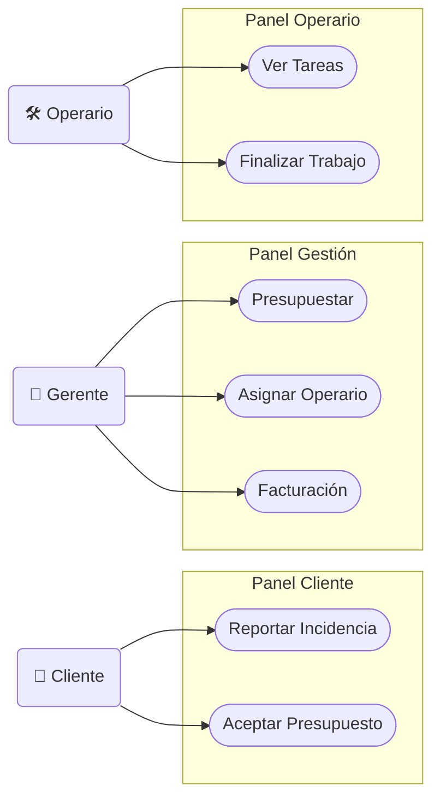
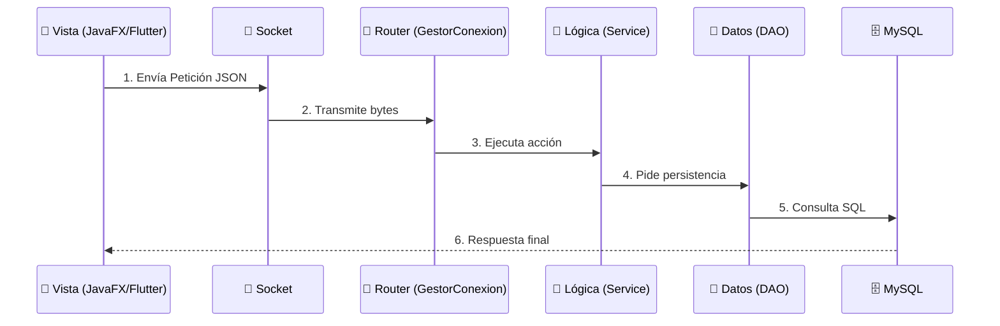

# 01. Análisis y Requisitos - FIXFINDER

Este documento unifica todo el análisis funcional, requisitos y flujos de usuario del proyecto FIXFINDER.

---

## 1. Introducción y Visión General

En este documento definimos el comportamiento funcional de **FIXFINDER**. El objetivo es establecer claramente qué puede hacer cada tipo de usuario dentro de la plataforma y cómo responde el sistema a esas acciones. Cubrimos todo el ciclo de vida del servicio, desde que un cliente notifica una avería hasta que se resuelve y factura.

---

## 2. Especificación de Requisitos (SRS)

### 2.1. Requerimientos Funcionales

| ID         | Descripción                       | Regla de Negocio                                                                                                                                      |
| :--------- | :-------------------------------- | :---------------------------------------------------------------------------------------------------------------------------------------------------- |
| **RF-001** | **Autenticación y Autorización**  | El sistema debe validar credenciales y determinar si el usuario es Admin, Cliente u Operario para restringir el acceso a las vistas correspondientes. |
| **RF-002** | **Registro de Usuarios**          | Permitir el alta de nuevos clientes desde la App Móvil verificando datos únicos (email).                                                              |
| **RF-010** | **Monitorización en Tiempo Real** | El Dashboard debe reflejar incidencias entrantes sin recarga manual.                                                                                  |
| **RF-011** | **Gestión de Presupuestos**       | Capacidad para crear y enviar valoraciones económicas antes de asignar técnicos.                                                                      |
| **RF-012** | **Asignación de Recursos**        | Vincular una incidencia aceptada a un operario disponible.                                                                                            |
| **RF-013** | **Facturación y Cierre**          | Generación automática de documentos de cobro al validar la finalización.                                                                              |
| **RF-020** | **Reporte de Averías**            | Entrada de datos estructurados (Título, Descripción, Urgencia) y multimedia (Fotos).                                                                  |
| **RF-022** | **Aprobación de Costes**          | El cliente debe poder aceptar o rechazar presupuestos explícitamente.                                                                                 |
| **RF-024** | **Imputación de Trabajo**         | El técnico debe registrar horas y materiales para justificar el coste final.                                                                          |

### 2.2. Requerimientos No Funcionales

- **Rendimiento**: Las interacciones críticas deben responder en < 2 segundos. El servidor debe soportar concurrencia mediante un pool de hilos.
- **Seguridad**: Contraseñas cifradas con BCrypt. Control de acceso basado en roles (RBAC).
- **Confiabilidad**: El servidor debe ser robusto ante desconexiones abruptas (broken pipes).

---

## 3. Casos de Uso

### 3.1. Identificación de Actores

| Perfil                | Responsabilidades                                                                   |
| :-------------------- | :---------------------------------------------------------------------------------- |
| **Empresa (Gerente)** | Gestor del negocio. Revisa incidencias, prepara presupuestos, gestiona operarios.   |
| **Cliente**           | Solicita servicio, aprueba presupuestos y confirma la reparación.                   |
| **Operario**          | Técnico de campo. Recibe avisos, realiza el trabajo e informa de materiales/tiempo. |

### 3.2. Catálogo de Funcionalidades

- **Gestión de Cuenta**: Registrarse, Iniciar Sesión, Editar Perfil.
- **Incidencias (Cliente)**: Reportar Incidencia, Adjuntar Fotos, Consultar Historial, Aceptar Presupuesto.
- **Gestión (Admin/Gerente)**: Buscador de Incidencias, Presupuestar, Asignar Operario, Facturación.
- **Trabajo (Operario)**: Ver Agenda, Reportar Trabajo, Finalizar.

### 3.3. Diagrama de Casos de Uso

_(Referencia visual: `assets/diagramaCasosUso.jpg`)_

---

## 4. Flujos de Usuario (Happy Path)

### 4.1. Flujo Principal de Trabajo

1.  **Solicitud**: El Cliente crea una incidencia desde la App (Estado: `PENDIENTE`).
2.  **Presupuesto**: El Gerente revisa y envía presupuesto (Estado: `PRESUPUESTADO`).
3.  **Aceptación**: El Cliente acepta el coste (Estado: `ACEPTADO`).
4.  **Asignación**: El Gerente asigna un Operario (Estado: `ASIGNADO`).
5.  **Ejecución**: El Operario realiza el trabajo y lo marca como realizado (Estado: `REALIZADO`).
6.  **Cierre**: El sistema genera la factura y el flujo termina (Estado: `FINALIZADO` / `PAGADO`).

---

## 5. Mapa Mental del Flujo de Datos

Este diagrama muestra cómo viaja la información entre las capas del sistema:

