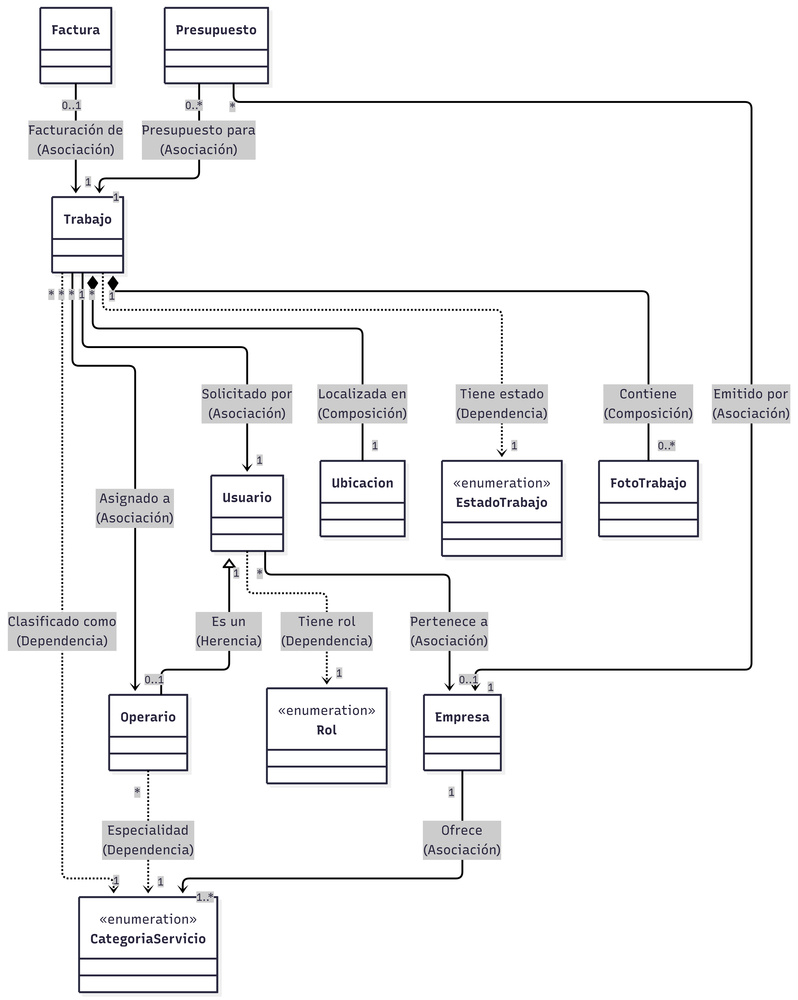

# MÒDUL PROJECTE - Índex proposat

## FixFinder - Noé Conde Vila - 2ºDAM

## 1. Introducció

- Presentació (i/o motivació) i objectiu del projecte.

  El objetivo principal de este proyecto es desarrollar **FixFinder**, una aplicación que pretende resolver de raíz la problemática de las reparaciones domésticas. La motivación nace de la necesidad de simplificar la vida a la gente: queremos crear una plataforma centralizada que permita a los usuarios reportar sus averías con todo tipo de detalle, fotos y urgencia, olvidándose del estrés de buscar técnicos por su cuenta.

- Factor diferenciador del projecte

  Lo que hace único a este proyecto es que conecta las dos partes de forma integral. Esta plataforma beneficiará enormemente a los usuarios que no tengan la capacidad de resolver sus averías por sí mismos, dándoles seguridad y rapidez. Y por otro lado, ofrece a las empresas una herramienta potente para captar clientes de forma masiva sin esfuerzos comerciales extra, ahorrando todo el tedioso proceso de búsqueda, llamadas y presupuestos perdidos que existe hoy en día tanto para clientes como para profesionales.

- Anàlisis de la situació de partida

  Cuando se te rompe algo en casa como un grifo, una luz o la calefacción, si no eres un "manitas" estás perdido: tienes que llamar a tu cuñado preguntándole si conoce a alguien de confianza, o ponerte a buscar en Google a ciegas sin saber a quién elegir entre tantas empresas desconocidas, ¿verdad? Es un proceso lento, lleno de incertidumbre y llamadas que no se contestan.

- Objectius a aconseguir amb el projecte

  Queremos digitalizar todo el proceso. Lograr que las empresas obtengan un nuevo sistema de captación de clientes moderno: podrán ver en su plataforma de escritorio las incidencias que los clientes publican al instante desde su app móvil y enviar un presupuesto de forma rápida y sencilla. El objetivo final es cerrar el círculo: si el cliente acepta, la empresa envía a su técnico especializado con su propia app móvil al lugar de la incidencia para realizar el trabajo. Y para rematar, cuando se finalice, el operario completa el formulario de albarán allí mismo y ambos podrán marcar el trabajo como finalizado, generando el albarán o factura automáticamente sin papeles de por medio.

- Relació amb els continguts dels diferents mòduls
  - **Accés a Dades**: Implementación de la persistencia de datos mediante Java JDBC y una base de datos relacional (MySQL).
  - **Desenvolupament d'Interfícies**: Diseño de interfaces de usuario tanto para la aplicación de escritorio (JavaFX) como para la aplicación móvil (Flutter), priorizando la usabilidad.
  - **Sistemes de Gestió Empresarial**: El desarrollo del núcleo del sistema (ERP) para que las empresas gestionen sus recursos, operarios y facturación.
  - **Optativa Núvol**: Despliegue de la API (Servidor Sockets) y la base de datos en una infraestructura cloud para garantizar accesibilidad remota.
  - **Programació Multimèdia i Dispositius Mòbils**: Desarrollo de las aplicaciones nativas para técnicos y clientes utilizando Flutter.
  - **Programació de Serveis i Processos**: Uso intensivo de programación concurrente (Hilos/Threads) para el servidor y comunicación mediante Sockets TCP/IP.
  - **Sostenibilitat**: El sistema elimina el uso de papel en albaranes y facturas, promoviendo una gestión "paperless" 100% digital.
  - **Digitalització**: Modernización del sector tradicional de reparaciones, transformando procesos manuales y telefónicos en flujos de datos digitales y trazables.

## 2. Presentació de les diverses tecnologies que es poden utilitzar per a la seua realització

### 2.1 Justificació de l’elecció de les tecnologies.

Hemos elegido el siguiente stack priorizando la capacidad de respuesta inmediata:

- **Java + Sockets TCP (Backend interactivo)**: Se ha optado conscientemente por una arquitectura basada en **Sockets persistentes** en lugar de una API REST tradicional.
  - _Justificación_: FixFinder requiere capacidades **Real-Time** críticas (ej: un operario debe recibir una urgencia al instante sin tener que recargar la app). Mientras que REST es pasivo, los Sockets permiten una comunicación bidireccional donde el servidor puede iniciar la transmisión ("Push"), garantizando una experiencia de usuario fluida y sin latencia.
- **MySQL (Persistencia)**: Garantiza la integridad ACID y la fiabilidad necesaria para los módulos de facturación y gestión de clientes.
- **JavaFX (Escritorio)**: Permite desarrollar interfaces de gestión complejas y robustas reutilizando la lógica de negocio Java.
- **Flutter (Móvil)**: Facilita crear una experiencia visual "Premium" unificada para Android e iOS con un solo código base.

## 3. Anàlisi del projecte

### 3.1. Requeriments funcionals i no funcionals

#### Requeriments funcionals

- **Identidad y Acceso**: Registro de nuevos clientes vía App y autenticación segura diferenciada por roles (Gerente/Cliente/Operario).
- **Gestión de Incidencias**: Creación de tickets de avería por parte de los clientes incluyendo título, descripción detallada, nivel de urgencia y evidencias multimedia (fotos).
- **Ciclo de Ventas**: Flujo completo de negociación online: la empresa emite presupuesto -> el cliente aprueba/rechaza desde el móvil.
- **Despacho de Servicios**: Asignación manual de órdenes de trabajo a operarios disponibles.
- **Ejecución de Campo**: Los técnicos reciben notificaciones push, consultan detalles del trabajo, navegan a la ubicación e imputan materiales y horas trabajadas.
- **Facturación y Cierre**: Generación automática de albaranes y facturas en PDF al validar la finalización del servicio.
- **Supervisión**: Dashboard en tiempo real para que la empresa monitorice el estado de todas las incidencias (Pendientes, Asignadas, Finalizadas).

#### Requeriments no funcionals

- **Rendimiento (Performance)**:
  - Arquitectura _Thread-per-client_ en el servidor para soportar alta concurrencia sin bloquear la interfaz.
  - Tiempos de respuesta en operaciones críticas (login, crear incidencia) inferiores a 2 segundos.
- **Seguridad**:
  - Almacenamiento seguro de contraseñas mediante algoritmos de Hashing (PBKDF2 con Salt).
  - Gestión de sesiones mediante **Tokens UUID persistentes en memoria** para evitar suplantación de identidad (ID Spoofing).
  - Control de Acceso Basado en Roles para proteger datos sensibles como facturación.
- **Usabilidad**: Interfaz moderna con paletas de colores oscuros, tipografía legible y feedback visual para asegurar una fácil adopción.

#### Analisi de costs i viabilitat del projecte

El proyecto presenta una **alta viabilidad** técnica y económica:

- **Costes de Licencias**: Nulos. Todo el stack tecnológico seleccionado (OpenJDK, MySQL, Flutter) es Open Source y gratuito.
- **Costes de Infraestructura**: Mínimos. La arquitectura ligera basada en Sockets permite un despliegue barato en cualquier servidor local o servicio Cloud.
- **Rentabilidad**: El modelo soluciona una necesidad real de mercado con una inversión inicial limitada únicamente a las horas de desarrollo e ingeniería.

### 3.2. Temporalització del projecte

- Fites del projecte
  - **Fita 1: Análisis y Definición** (Completado - Oct/Nov)
    - Definición de requerimientos, diseño de BD, Diagramas UML (Casos de uso/Clases).
  - **Fita 2: Core del Sistema y Persistencia** (Completado - Dic)
    - Implementación de BD MySQL, Servidor Java Sockets y DAOs.
    - Autenticación y Registro de usuarios (Roles y Seguridad).
  - **Fita 3: Prototipo Funcional de Gestión** (Completado - Ene)
    - Cliente JavaFX básico (Dashboard de pruebas).
  - **Fita 4: Desarrollo Móvil y Refinamiento** (Pendiente - Feb/Mar)
    - Desarrollo de App Flutter (Interfaz Cliente/Operario).
    - Lógica de Negocio avanzada (Filtros de privacidad para empresas).
    - Notificaciones push y Chat.
  - **Fita 5: Entrega Final y Defensa** (Pendiente - May/Jun)
    - Integración total, pruebas de estrés y Memoria final.

- Diagrama de Gantt

{width=90%}

### 3.3. Casos d’ús

- Diagrama de casos d’ús
  

- Descripció dels casos d’ús
  El sistema define tres actores principales con funcionalidades diferenciadas:

  **1. Actor: Administrador (Gerente de Empresa)**
  - **Gestión de Usuarios**: Puede dar de alta a nuevos Operarios de su empresa.
  - **Gestión de Trabajos**: Visualiza todas las incidencias y las asigna a los técnicos.
  - **Gestión Financiera**: Genera facturas en PDF una vez finalizados los trabajos.
  - **Supervisión**: Monitoriza el estado global de las reparaciones en tiempo real.

  **2. Actor: Cliente (Usuario Final)**
  - **Registro**: Se da de alta en la App móvil.
  - **Solicitar Avería**: Crea una nueva incidencia detallando el problema y adjuntando fotos.
  - **Seguimiento**: Consulta el estado de sus reparaciones y recibe presupuestos.

  **3. Actor: Operario (Técnico)**
  - **Recepción de Tareas**: Recibe notificaciones de trabajos asignados.
  - **Ejecución**: Consulta los detalles de la avería y la dirección del cliente.
  - **Cierre de Orden**: Imputa horas/materiales y marca el trabajo como finalizado, disparando el proceso de facturación.

### 3.4. Diagrama de classes inicial

- Diagrama de classes

  

- Descripció de les classes
  El modelo de dominio se estructura en torno a las siguientes entidades clave:
  - **`Usuario` (Abstracta)**: Clase base con datos de acceso (email, pass), nombre y DNI.
  - **`Cliente` y `Operario`**: Heredan de Usuario. `Operario` añade vinculación a una empresa (`idEmpresa`), especialidad (`CategoriaServicio`) y estado de disponibilidad.
  - **`Empresa`**: Entidad proveedora de servicios. Contiene datos fiscales (CIF, dirección) y lista de especialidades que ofrece.
  - **`Trabajo`**: La incidencia reportada. Vincula a un Cliente y asigna un Operario. Contiene estado, ubicación y fotos.
  - **`Presupuesto`**: Oferta económica vinculada a un trabajo antes de su ejecución. Incluye monto y fecha de envío.
  - **`Factura`**: Documento final de cobro asociado a un trabajo terminado. Incluye desglose de importes (Base, IVA, Total) y referencia al PDF.

- Diagrama entitat-relació (si escau)

## 3.5. Mockups d’interfícies

### 3.6. Altres diagrames i descripcions (si escau)

## 4. Disseny del projecte

### 4.1. Arquitectura del sistema

- Descripció de l’arquitectura

  El sistema implementa una arquitectura **Cliente-Servidor Distribuida e Híbrida**, diseñada para garantizar la integridad de los datos y el funcionamiento en tiempo real.
  1.  **Núcleo Central (Backend)**: Un **Servidor Java** multihilo alojado en la nube (VPS). Este componente es el "cerebro" del sistema; gestiona toda la lógica de negocio, la seguridad y es el único punto de acceso a la base de datos **MySQL** para garantizar la consistencia. La comunicación se realiza mediante **Sockets TCP persistentes**, lo que permite una transmisión de datos bidireccional instantánea (necesaria para asignar tareas en tiempo real).

  2.  **Clientes, Operarios y Gerentes (Frontend)**:
      - **Escritorio (JavaFX)**: Panel de administración para la empresa. No contiene lógica de base de datos, solo visualización y gestión.
      - **Móvil (Flutter)**: Aplicación unificada para Clientes y Operarios. Se conecta al servidor para operaciones de datos.

  3.  **Servicios Satélite (Firebase)**: Se integra **Google Firebase** como servicio complementario para descargar al servidor principal de tareas pesadas:
      - **Firebase Storage**: Almacenamiento escalable de las fotos de las incidencias.
      - **Firebase Cloud Messaging (FCM)**: Gestión de notificaciones push para despertar a los dispositivos móviles cuando hay nuevas tareas.

- Diagrama de l’arquitectura

- Diagrama de desplegament

### 4.2. Diagrama de classes definitiu

- Diagrama de classes

- Descripció de les classes

  El modelo de dominio se organiza en paquetes lógicos para facilitar su mantenimiento y escalabilidad:
  1.  **Paquete Usuarios (`com.fixfinder.modelos.usuarios`)**:
      - **`Usuario`** (Abstracta): Entidad base que centraliza la seguridad (email, password_hash, rol). Todos los actores heredan de ella.
      - **`Cliente`**: Hereda de Usuario. Representa al solicitante del servicio. Contiene historial de pedidos.
      - **`Operario`**: Hereda de Usuario. Representa al técnico de campo. Añade atributos de `Empresa` a la que pertenece, `Especidalidad` (Fontanería, Electricidad...) y geolocalización en tiempo real (`latitud`, `longitud`).
      - **`Empresa`**: Representa la entidad jurídica proveedora de servicios.

  2.  **Paquete Negocio (`com.fixfinder.modelos.negocio`)**:
      - **`Trabajo`**: La clase central del sistema. Representa una incidencia o reparación. Vincula un `Cliente` con un `Operario` y maneja una máquina de estados compleja (PENDIENTE -> ASIGNADO -> FINALIZADO -> PAGADO).
      - **`Presupuesto`**: Propuesta económica vinculada a un Trabajo. Permite la negociación previa.
      - **`Factura`**: Documento legal inmutable que se genera al finalizar un trabajo. Contiene los cálculos fiscales y referencias al archivo PDF.

  3.  **Paquete Auxiliar**:
      - **`FotoTrabajo`**: Gestiona las evidencias multimedia (URLs de Firebase) asociadas a una reparación.

- Diagrama entitat-relació

### 4.3. Disseny de la interfície d’usuari

- Wireframes
- Diagrama de navegació

### 4.4. Altres diagrames i descripcions (si escau)

## 5. Implementació del projecte

- Estructura del projecte
- Descripció dels mòduls i components principals
- Desplegament de l’aplicació
- Captures de pantalla i exemples de codi (el codi es recomana ficar-ho als annexes)

## 6. Estudi dels resultats obtinguts

- Avaluació del projecte respecte als objectius inicials
- Problemes trobats i solucions aplicades
- Futures millores i ampliacions

## 7. Conclusions

- Relacions amb els continguts dels diferents mòduls
- Valoració personal del projecte

## 8. Bibliografia i recursos utilitzats

## 9. Annexes

- Codi font complet del projecte
- Guia d’instal·lació i ús
- Documentació addicional
- Altres materials rellevants
