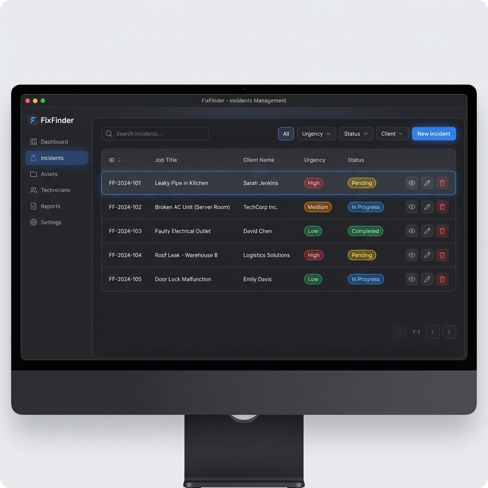

# FixFinder Desktop Mockups - Walkthrough

He movido los mockups a la carpeta `docs/mockups` de tu proyecto para que puedas visualizarlos correctamente. Aquí tienes la explicación de cada panel:

## 1. Panel Principal (Dashboard)

El centro de mando para el gerente de la empresa. Ofrece una visión global del estado del negocio en tiempo real.

- **Estadísticas clave**: Trabajos activos, presupuestos pendientes y facturación mensual con gráficos dinámicos.
- **Actividad Reciente**: Un feed de eventos para monitorizar lo que está ocurriendo al instante.
- **Navegación Intuitiva**: Menú lateral para acceder rápidamente a todas las secciones.

---

## 2. Gestión de Incidencias

Donde se listan todos los avisos recibidos de los clientes.

- **Filtrado avanzado**: Por estado (Pendiente, En Proceso, Finalizado) y prioridad.
- **Identificación rápida**: Colores para la urgencia y badges de estado para facilitar la gestión masiva.
- **Buscador integrado**: Para localizar rápidamente cualquier ticket por nombre o ID.

---

## 3. Detalle de Trabajo y Presupuesto

Vista detallada de una avería específica para proceder a su valoración técnica.

- **Evidencias Multimedia**: Visualización de las fotos enviadas por el cliente.
- **Generación de Presupuesto**: Panel para introducir costes de mano de obra y materiales.
- **Asignación de Técnico**: Selector intuitivo con avatars para delegar el trabajo al operario adecuado.

---

## 4. Gestión de la Plantilla (Técnicos)

Control de los recursos humanos de la empresa.

- **Tarjetas de Operario**: Información de contacto, especialidad y estado de disponibilidad.
- **Estado en tiempo real**: Indicadores visuales de si un técnico está libre o en una intervención.
- **Mapa en vivo**: Visualización de la ubicación de los técnicos (si la funcionalidad está activada).

---

> [!TIP]
> Puedes encontrar las imágenes originales en la carpeta `docs/mockups/` de este proyecto.
