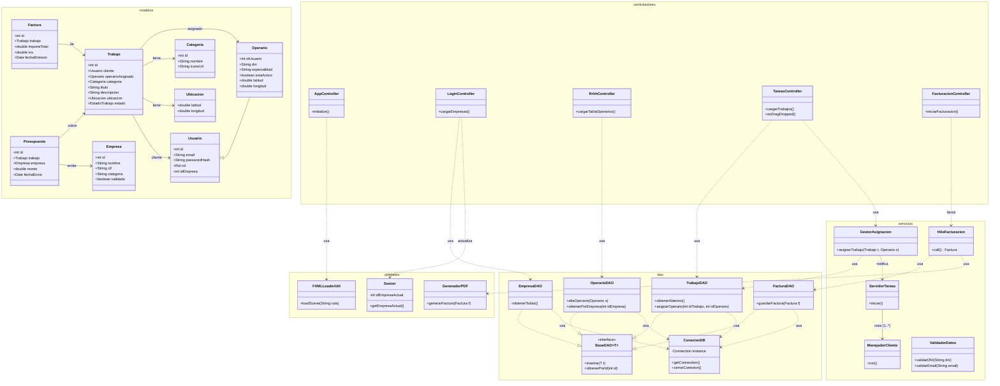

# Diagrama de Clases - FIXFINDER

Este diagrama representa la estructura completa del proyecto, dividida en los 5 paquetes definidos.

```mermaid
classDiagram
    %% ---------------------------------------------------------
    %% 1. PAQUETE MODELOS (Entidades)
    %% ---------------------------------------------------------
    namespace modelos {
        class Usuario {
            +int id
            +String email
            +String passwordHash
            +Rol rol
            +int idEmpresa
        }
        class Operario {
            +int idUsuario
            +String dni
            +String especialidad
            +boolean estaActivo
            +double latitud
            +double longitud
        }
        class Empresa {
            +int id
            +String nombre
            +String cif
            +String categoria
            +boolean validada
        }
        class Categoria {
            +int id
            +String nombre
            +String iconoUrl
        }
        class Ubicacion {
            +double latitud
            +double longitud
        }
        class Trabajo {
            +int id
            +Usuario cliente
            +Operario operarioAsignado
            +Categoria categoria
            +String titulo
            +String descripcion
            +Ubicacion ubicacion
            +EstadoTrabajo estado
        }
        class Presupuesto {
            +int id
            +Trabajo trabajo
            +Empresa empresa
            +double monto
            +Date fechaEnvio
        }
        class Factura {
            +int id
            +Trabajo trabajo
            +double importeTotal
            +double iva
            +Date fechaEmision
        }
    }

    %% Herencia y Relaciones Modelos
    Usuario <|-- Operario
    Trabajo --> Usuario : cliente
    Trabajo --> Operario : asignado
    Trabajo --> Categoria : tiene
    Trabajo --> Ubicacion : tiene
    Presupuesto --> Trabajo : sobre
    Presupuesto --> Empresa : emite
    Factura --> Trabajo : de

    %% ---------------------------------------------------------
    %% 2. PAQUETE DAO (Acceso a Datos)
    %% ---------------------------------------------------------
    namespace dao {
        class ConexionDB {
            -Connection instance
            +getConnection()
            +cerrarConexion()
        }
        class BaseDAO~T~ {
            <<interface>>
            +insertar(T t)
            +obtenerPorId(int id)
        }
        class EmpresaDAO {
            +obtenerTodas()
        }
        class OperarioDAO {
            +altaOperario(Operario o)
            +obtenerPorEmpresa(int idEmpresa)
        }
        class TrabajoDAO {
            +obtenerAbiertos()
            +asignarOperario(int idTrabajo, int idOperario)
        }
        class FacturaDAO {
            +guardarFactura(Factura f)
        }
    }

    %% Relaciones DAO
    EmpresaDAO ..|> BaseDAO
    OperarioDAO ..|> BaseDAO
    TrabajoDAO ..|> BaseDAO
    FacturaDAO ..|> BaseDAO
    EmpresaDAO ..> ConexionDB : usa
    OperarioDAO ..> ConexionDB : usa
    TrabajoDAO ..> ConexionDB : usa
    FacturaDAO ..> ConexionDB : usa

    %% ---------------------------------------------------------
    %% 3. PAQUETE SERVICIOS (Lógica y PSP)
    %% ---------------------------------------------------------
    namespace servicios {
        class ServidorTareas {
            +iniciar()
        }
        class ManejadorCliente {
            +run()
        }
        class HiloFacturacion {
            +call() Factura
        }
        class GestorAsignacion {
            +asignarTrabajo(Trabajo t, Operario o)
        }
        class ValidadorDatos {
            +validarDNI(String dni)
            +validarEmail(String email)
        }
    }

    %% Relaciones Servicios
    ServidorTareas --> ManejadorCliente : crea (1..*)
    GestorAsignacion ..> TrabajoDAO : usa
    GestorAsignacion ..> ServidorTareas : notifica
    HiloFacturacion ..> FacturaDAO : usa

    %% ---------------------------------------------------------
    %% 4. PAQUETE CONTROLADORES (JavaFX)
    %% ---------------------------------------------------------
    namespace controladores {
        class AppController {
            +initialize()
        }
        class LoginController {
            +cargarEmpresas()
        }
        class RrhhController {
            +cargarTablaOperarios()
        }
        class TareasController {
            +cargarTrabajos()
            +onDragDropped()
        }
        class FacturacionController {
            +iniciarFacturacion()
        }
    }

    %% Relaciones Controladores
    LoginController ..> EmpresaDAO : usa
    RrhhController ..> OperarioDAO : usa
    TareasController ..> TrabajoDAO : usa
    TareasController ..> GestorAsignacion : usa
    FacturacionController ..> HiloFacturacion : lanza

    %% ---------------------------------------------------------
    %% 5. PAQUETE UTILIDADES
    %% ---------------------------------------------------------
    namespace utilidades {
        class Sesion {
            -int idEmpresaActual
            +getEmpresaActual()
        }
        class GeneradorPDF {
            +generarFactura(Factura f)
        }
        class FXMLLoaderUtil {
            +loadScene(String ruta)
        }
    }

    %% Relaciones Utilidades
    HiloFacturacion ..> GeneradorPDF : usa
    AppController ..> FXMLLoaderUtil : usa
    LoginController ..> Sesion : actualiza
```
