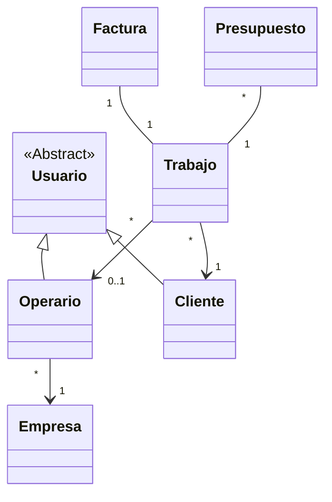

# 02. Diseño y Arquitectura - FIXFINDER

Este documento detalla la estructura técnica, el modelo de datos y el protocolo de comunicación del sistema.

---

## 1. Arquitectura del Sistema

El sistema sigue una arquitectura cliente-servidor basada en capas para asegurar el desacoplamiento:

### 📦 Responsabilidades por Paquete (Backend)

- **`modelos`**: POJOs puros (Entidades de negocio).
- **`dao`**: Aísla el código SQL. Incluye `ConexionDB` (Singleton) para optimizar recursos.
- **`servicios`**: Lógica de negocio pura. Orquestan las llamadas a los DAOs.
- **`red`**: Manejo de Sockets. `ServidorCentral` abre el puerto y `GestorConexion` gestiona cada hilo cliente.

### 🔄 Flujos Críticos

- **Asignación**: JavaFX -> Sockets -> Operario (Móvil).
- **Facturación**: Proceso en segundo plano (`Thread`) para no bloquear la UI de escritorio.

---

## 2. Modelo de Datos (Diagrama de Clases)

Representación de las entidades principales y sus relaciones:



---

## 3. Protocolo de Comunicación (JSON over Sockets)

La comunicación se realiza mediante `DataInputStream.readUTF()` y `DataOutputStream.writeUTF()`.

### Estructura General

**Petición (Cliente -> Servidor):**

```json
{
  "accion": "NOMBRE_ACCION",
  "datos": { ... }
}
```

**Respuesta (Servidor -> Cliente):**

```json
{
  "status": 200,
  "mensaje": "Texto descriptivo",
  "datos": { ... }
}
```

### Catálogo de Acciones Principales

1.  **`LOGIN`**: Autenticación de usuarios.
2.  **`CREAR_TRABAJO`**: Alta de incidencia (soporta array `urls_fotos`).
3.  **`LISTAR_TRABAJOS`**: Obtención de histórico según rol.
4.  **`ASIGNAR_OPERARIO`**: Vinculación técnica (Solo Gerente).
5.  **`FINALIZAR_TRABAJO`**: Cierre técnico y generación de factura.

---

## 4. Esquema de Base de Datos (SQL)

```sql
-- Estructura simplificada del esquema actual
CREATE TABLE usuario (
    id INT AUTO_INCREMENT PRIMARY KEY,
    email VARCHAR(100) UNIQUE,
    rol ENUM('ADMIN', 'GERENTE', 'OPERARIO', 'CLIENTE')
);

CREATE TABLE trabajo (
    id INT AUTO_INCREMENT PRIMARY KEY,
    id_cliente INT,
    id_operario INT,
    estado ENUM('PENDIENTE', 'PRESUPUESTADO', 'ACEPTADO', 'ASIGNADO', 'REALIZADO', 'FINALIZADO'),
    FOREIGN KEY (id_cliente) REFERENCES usuario(id)
);

CREATE TABLE foto_trabajo (
    id INT AUTO_INCREMENT PRIMARY KEY,
    id_trabajo INT,
    url_archivo TEXT, -- Soporta URLs largas de Firebase
    FOREIGN KEY (id_trabajo) REFERENCES trabajo(id)
);
```

_(Para ver el script completo de creación, consultar el archivo original: `assets/ESQUEMA_BD.sql`)_
