# Análisis de Casos de Uso - FIXFINDER

## 1. Introducción

En este documento definimos el comportamiento funcional de **FIXFINDER**. El objetivo es establecer claramente qué puede hacer cada tipo de usuario dentro de la plataforma y cómo responde el sistema a esas acciones. Cubrimos todo el ciclo de vida del servicio, desde que un cliente notifica una avería hasta que se resuelve y factura.

## 2. Identificación de Actores

Estos son los perfiles que interactúan en la aplicación:

| Perfil       | Responsabilidades                                                                                                                                            |
| :----------- | :----------------------------------------------------------------------------------------------------------------------------------------------------------- |
| **Empresa**  | Es el gestor del negocio. Se encarga de revisar las incidencias que entran, preparar los presupuestos, dar de alta a los operarios y asignarles el trabajo.  |
| **Cliente**  | El usuario que solicita el servicio. Interactúa con la app para reportar problemas, aprobar los presupuestos y confirmar que la reparación se ha hecho bien. |
| **Operario** | El técnico que va al lugar de la avería. Recibe los avisos en su móvil, realiza el trabajo e informa de los materiales y tiempo gastado.                     |
| **Sistema**  | (Agente pasivo) Realiza las tareas automáticas de fondo, como enviar notificaciones push, validar contraseñas o cambiar estados en la base de datos.         |

---

## 3. Catálogo de Funcionalidades (Casos de Uso)

Aquí listamos todas las operaciones posibles en el sistema, ordenadas por módulos.

### 3.1. Gestión de Acceso y Cuenta (Común)

- **CU-02:** Registrarse
- **CU-01:** Iniciar Sesión
- **CU-04:** Editar Perfil
- **CU-05:** Cerrar Sesión
- **CU-03:** Recuperar Contraseña

### 3.2. Incidencias (Zona Cliente)

- **CU-06:** Reportar nueva Incidencia
- **CU-07:** Adjuntar Fotos/Evidencias
- **CU-08:** Consultar Historial y Estado
- **CU-09:** Cancelar Incidencia
- **CU-10:** Aceptar Presupuesto
- **CU-11:** Validar y Cerrar Reparación

### 3.3. Administración y Gestión

- **CU-14:** Buscador de Incidencias
- **CU-13:** Gestionar Presupuesto y Asignación
- **CU-16:** Facturación
- **CU-15:** Gestión de la plantilla de Operarios

### 3.4. Zona de Trabajo (Operarios)

- **CU-17:** Ver Tareas Pendientes
- **CU-18:** Reportar Trabajo Realizado
- **CU-19:** Enviar Ubicación

---

## 4. Desarrollo de los Flujos Principales

A continuación explicamos paso a paso cómo funciona el ciclo principal de una reparación, que es el proceso más importante de la aplicación.

### **4.1 Creación de la solicitud (CU-06)**

- **Quién:** Cliente
- **Cómo funciona:**
  1.  El cliente accede a la opción de "Nueva Reparación" en la app.
  2.  Rellena los datos básicos: qué le pasa (título y descripción) y qué nivel de urgencia tiene. Si quiere, puede subir una foto para que se vea mejor el problema.
  3.  Al enviar, la incidencia queda registrada en estado **"Pendiente de Revisión"**.

### **4.2 Valoración y Presupuesto (CU-13)**

- **Quién:** Administrador
- **Cómo funciona:**
  1.  El administrador ve que ha entrado una nueva incidencia.
  2.  Analiza la descripción y la foto para estimar cuánto costará.
  3.  Redacta un presupuesto aproximado y lo envía a través de la plataforma. El estado pasa a **"Esperando Aceptación"**.

### **4.3 Aceptación del Cliente (CU-10)**

- **Quién:** Cliente
- **Cómo funciona:**
  1.  El cliente recibe el aviso de que ya tiene presupuesto.
  2.  Entra en la app, ve el precio estimado y le da a "Aceptar".
  3.  El sistema avisa inmediatamente a la administración para que ponga el trabajo en marcha.

### **4.4 Asignación de Técnico (CU-13 - Fase Asignación)**

- **Quién:** Administrador
- **Cómo funciona:**
  1.  Una vez el cliente ha dado el OK, el administrador busca un operario que esté libre o cerca.
  2.  Le asigna la incidencia. El estado cambia a **"Asignada"** y al técnico le salta el aviso en su perfil.

### **4.5 Ejecución del Trabajo (CU-18)**

- **Quién:** Operario
- **Cómo funciona:**
  1.  El técnico va al sitio y arregla la avería.
  2.  En su app, entra en la tarea y anota lo que ha hecho realmente: materiales usados y horas invertidas.
  3.  Marca la tarea como **"Trabajo Realizado"**. Ojo: la incidencia no se cierra todavía, queda a la espera de que el cliente dé el visto bueno.

### **4.6 Validación y Cierre (CU-11)**

- **Quién:** Cliente
- **Cómo funciona:**
  1.  El cliente comprueba que la reparación está bien hecha.
  2.  Pulsa el botón de **"Validar y Finalizar"**.
  3.  Ahora sí, la incidencia pasa a estado **"Cerrada"** definitivo y el sistema genera la factura correspondiente.

---

## 5. Diagrama Casos de Uso

```mermaid
graph LR
    %% --- ACTORES ---
    Client("👤 Cliente")
    Admin("🏢 Admin")
    Tech("🛠️ Operario")

    %% --- BLOQUE 1: ACCESO (Reordenado) ---
    subgraph G_ACCESO [Gestión de Cuenta]
        direction TB
        UC2(["Registrarse"])
        UC1(["Iniciar Sesión"])
        UC4(["Editar Perfil"])
        UC5(["Cerrar Sesión"])
    end

    %% --- BLOQUE 2: CLIENTE ---
    subgraph G_CLIENTE [Panel Cliente]
        direction TB
        UC6(["Reportar Incidencia"])
        UC8(["Ver Historial"])
        UC10(["Aceptar Presupuesto"])
        UC11(["Validar Cierre"])
    end

    %% --- BLOQUE 3: ADMIN ---
    subgraph G_ADMIN [Panel Administrador]
        direction TB
        UC14(["Buscador Incidencias"])
        UC_SEL(["Seleccionar Incidencia"])
        UC13(["Presupuestar"])
        UC_ASIG(["Asignar Operario"])
        UC16(["Facturación"])

        UC15(["Gestión Operarios"])
        UC_NOP(["Crear Nuevo Operario"])
    end

    %% --- BLOQUE 4: TÉCNICO ---
    subgraph G_TECNICO [Panel Técnico]
        direction TB
        UC17(["Ver Tareas"])
        UC18(["Reportar Trabajo"])
        UC19(["Enviar Ubicación"])
    end

    %% --- RELACIONES DIRECTAS (Quién usa qué) ---
    Client --> UC2 & UC1 & UC4 & UC5
    Admin --> UC1 & UC4 & UC5
    Tech --> UC1 & UC4 & UC5

    Client --> UC6 & UC8 & UC10 & UC11

    Admin --> UC14 & UC16 & UC15

    Tech --> UC17 & UC19

    %% --- FLUJO DE PROCESO ---

    %% 1. Gestión de Operarios
    UC15 ==> UC_NOP

    %% 2. Ciclo de Vida de la Incidencia (Camino Feliz)
    UC6 ==> UC14
    UC14 ==> UC_SEL
    UC_SEL ==> UC13

    %% Del presupuesto al cliente -> Cliente Acepta -> Vuelve a Admin (Asignar)
    UC13 -.-> UC10
    UC10 ==> UC_ASIG

    %% Admin Asigna -> Operario Reporta Trabajo (Directo)
    UC_ASIG ==> UC18

    %% Relación interna Técnico
    UC17 -.-> UC18

    %% Validación y Cierre
    UC18 ==> UC11
    UC11 ==> UC16
```

