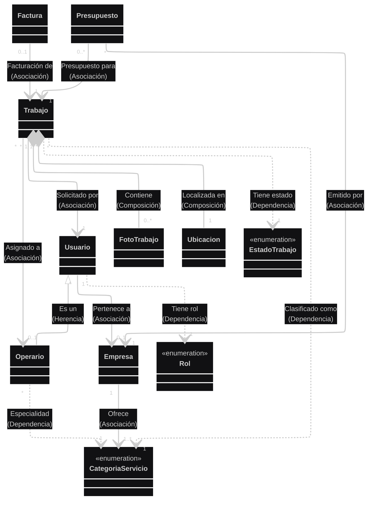
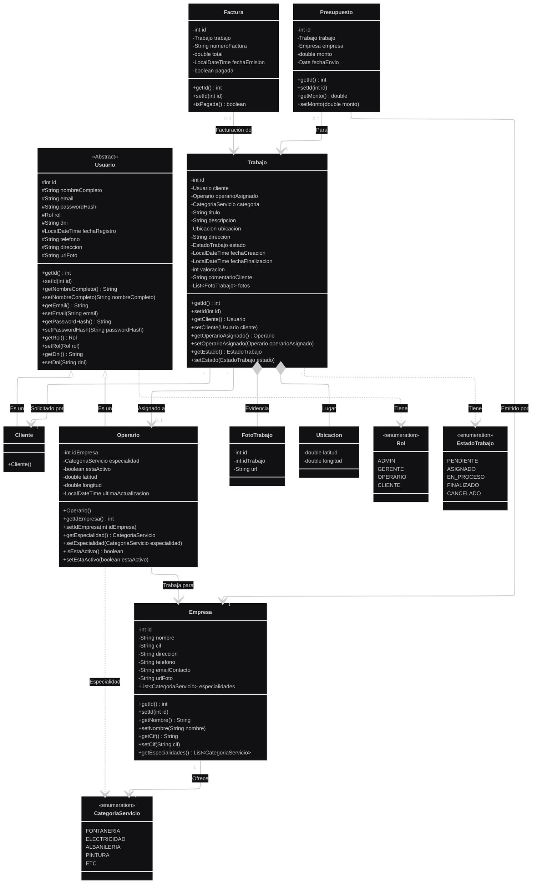

# Diagrama de Clases - FIXFINDER

A continuación se presentan los diagramas de clases del **Modelo de Dominio**, que representan las entidades principales de información, sus atributos y las relaciones entre ellas.

## 1. Diagrama Simplificado (Solo Clases y Relaciones)

## 2. Diagrama Detallado (Completo)

Vista técnica alineada con el código Java, incluyendo atributos completos y todos los métodos (Constructores, Getters y Setters).

