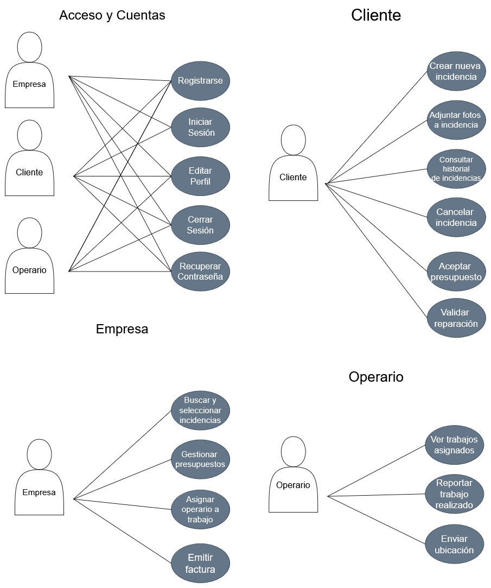

# 01. Análisis y Requisitos - FIXFINDER

Este documento unifica todo el análisis funcional, requisitos y flujos de usuario del proyecto FIXFINDER.

---

## 1. Introducción y Visión General

En este documento definimos el comportamiento funcional de **FIXFINDER**. El objetivo es establecer claramente qué puede hacer cada tipo de usuario dentro de la plataforma y cómo responde el sistema a esas acciones. Cubrimos todo el ciclo de vida del servicio, desde que un cliente notifica una avería hasta que se resuelve y factura.

---

## 2. Especificación de Requisitos (SRS)

### 2.1. Requerimientos Funcionales

| ID         | Descripción                       | Regla de Negocio                                                                                                                                      |
| :--------- | :-------------------------------- | :---------------------------------------------------------------------------------------------------------------------------------------------------- |
| **RF-001** | **Autenticación y Autorización**  | El sistema debe validar credenciales y determinar si el usuario es Admin, Cliente u Operario para restringir el acceso a las vistas correspondientes. |
| **RF-002** | **Registro de Usuarios**          | Permitir el alta de nuevos clientes desde la App Móvil verificando datos únicos (email).                                                              |
| **RF-010** | **Monitorización en Tiempo Real** | El Dashboard debe reflejar incidencias entrantes sin recarga manual.                                                                                  |
| **RF-011** | **Gestión de Presupuestos**       | Capacidad para crear y enviar valoraciones económicas antes de asignar técnicos.                                                                      |
| **RF-012** | **Asignación de Recursos**        | Vincular una incidencia aceptada a un operario disponible.                                                                                            |
| **RF-013** | **Facturación y Cierre**          | Generación automática de documentos de cobro al validar la finalización.                                                                              |
| **RF-020** | **Reporte de Averías**            | Entrada de datos estructurados (Título, Descripción, Urgencia) y multimedia (Fotos).                                                                  |
| **RF-022** | **Aprobación de Costes**          | El cliente debe poder aceptar o rechazar presupuestos explícitamente.                                                                                 |
| **RF-024** | **Imputación de Trabajo**         | El técnico debe registrar horas y materiales para justificar el coste final.                                                                          |

### 2.2. Requerimientos No Funcionales

- **Rendimiento**: Las interacciones críticas deben responder en < 2 segundos. El servidor debe soportar concurrencia mediante un pool de hilos.
- **Seguridad**: Contraseñas cifradas con BCrypt. Control de acceso basado en roles (RBAC).
- **Confiabilidad**: El servidor debe ser robusto ante desconexiones abruptas (broken pipes).

### 2.3. Plataformas de Despliegue

- **Cliente de Escritorio (Administración):**
  - Sistema Operativo: Windows 10/11.
  - Tecnología: JavaFX (JDK 21+).
- **Aplicación Móvil (Cliente/Operario):**
  - Sistema Operativo: Android 12+.
  - Tecnología: Android Nativo o Flutter (según fase).

### 2.4. Especificaciones de Diseño (UI/UX)

- **Estética:** Diseño moderno y "Premium", utilizando paletas de colores oscuros o de alto contraste para facilitar la lectura en campo.
- **Tipografía:** Fuentes sans-serif limpias (ej. Inter, Roboto) para máxima legibilidad.
- **Feedback:** Uso de micro-animaciones para confirmar acciones críticas (envío de incidencias, validaciones).

---

## 3. Casos de Uso

### 3.1. Identificación de Actores

| Perfil                | Responsabilidades                                                                   |
| :-------------------- | :---------------------------------------------------------------------------------- |
| **Empresa (Gerente)** | Gestor del negocio. Revisa incidencias, prepara presupuestos, gestiona operarios.   |
| **Cliente**           | Solicita servicio, aprueba presupuestos y confirma la reparación.                   |
| **Operario**          | Técnico de campo. Recibe avisos, realiza el trabajo e informa de materiales/tiempo. |

### 3.2. Catálogo de Funcionalidades

- **Gestión de Cuenta**: Registrarse, Iniciar Sesión, Editar Perfil.
- **Incidencias (Cliente)**: Reportar Incidencia, Adjuntar Fotos, Consultar Historial, Aceptar Presupuesto.
- **Gestión (Admin/Gerente)**: Buscador de Incidencias, Presupuestar, Asignar Operario, Facturación.
- **Trabajo (Operario)**: Ver Agenda, Reportar Trabajo, Finalizar.

### 3.3. Diagrama de Casos de Uso

---

## 4. Flujos de Usuario (Happy Path)

Este documento describe el ciclo de vida completo de un servicio en la aplicación, desde la configuración inicial hasta la facturación.

### 4.1. Configuración Inicial (App Escritorio - Rol Admin/Gerente)

1.  **Arranque**: Se inicia la aplicación de escritorio.
2.  **Registro de Empresa**: Se registra una nueva empresa proveedora de servicios (en esta fase simulamos una única empresa).
3.  **Login Empresa**: El gerente inicia sesión.
4.  **Gestión de Plantilla**: Registro de múltiples operarios con diferentes roles y categorías profesionales.

### 4.2. Solicitud de Servicio (App Móvil - Rol Cliente)

1.  **Registro/Login**: El usuario final se registra y accede a la app móvil.
2.  **Crear Incidencia**: Rellena un formulario con los datos del problema (descripción, urgencia, ubicación, etc.).
3.  **Subir Incidencia**: Se envía la solicitud al servidor.

### 4.3. Gestión y Presupuesto (App Escritorio - Rol Empresa)

1.  **Búsqueda de Incidencias**: La empresa visualiza un mapa o lista de incidencias cercanas.
2.  **Filtrado Inteligente**: Por defecto filtra por la categoría profesional de la empresa, pero permite cambiar filtros manualmente.
3.  **Evaluación**: Selecciona una incidencia pendiente creada por un cliente.
4.  **Envío de Presupuesto**: Evalúa el problema y envía una propuesta económica (presupuesto).

### 4.4. Aceptación (App Móvil - Rol Cliente)

1.  **Notificación**: El cliente recibe el presupuesto en su lista de incidencias.
2.  **Aceptación**: El cliente acepta el presupuesto propuesto.

### 4.5. Asignación y Ejecución (App Escritorio/Móvil - Rol Empresa/Operario)

1.  **Asignación (Escritorio)**: La empresa ve que el presupuesto ha sido aceptado y selecciona un operario disponible para el trabajo.
2.  **Notificación (Móvil Operario)**: Al operario le llega la orden de trabajo con toda la información.
3.  **Ejecución**: El operario se desplaza y realiza la reparación (simulado).
4.  **Finalización**: Tanto el Operario (en su app) como el Cliente confirman que el trabajo ha finalizado.

### 4.6. Cierre y Facturación

1.  **Factura**: La confirmación de finalización genera automáticamente la factura del servicio.

---

## 5. Mapa Mental del Flujo de Datos

Este diagrama muestra paso a paso qué ocurre cuando un usuario realiza una acción, quién es el responsable de cada tarea y cómo viaja la información.

### 5.1. Leyenda de Colores/Capas

- **(VISTA)**: Lo que ve el usuario (JavaFX).
- **(RED)**: El cable/wifi por donde viajan los datos.
- **(ROUTER)**: Quien recibe y distribuye el trabajo en el servidor.
- **(CEREBRO)**: Quien piensa y aplica las normas de negocio.
- **(MEMORIA)**: Quien lee/escribe en la base de datos SQL.

### 5.2. Mapa de Responsabilidades (Quién hace qué)

#### 1. 🖥️ Controladores de Vista (Frontend)

Solo se preocupan de la **INTERFAZ**.

- Recoger texto de los inputs.
- Mostrar alertas de error.
- **NO** validan DNIs ni reglas complejas.
- **NO** saben SQL.

#### 2. 🤵 GestorCliente (Router del Servidor)

Solo se preocupa de la **COMUNICACIÓN**.

- Lee el objeto del socket.
- `switch(accion)` para decidir a quién llamar.
- Encatcha errores generales (servidor caído, JSON mal formado).
- **NO** sabe si un DNI es válido o no. Solo pasa el paquete.

#### 3. 🧠 Servicios (Lógica de Negocio)

Aquí está la **INTELIGENCIA**. Tendremos varios especialistas:

| Servicio               | Responsabilidad         | Acciones que maneja                                                                       |
| :--------------------- | :---------------------- | :---------------------------------------------------------------------------------------- |
| **`ServicioAuth`**     | Seguridad y Accesos     | `LOGIN`, `REGISTRO_CLIENTE`, `REGISTRO_EMPRESA`, `LOGOUT`                                 |
| **`ServicioEmpresa`**  | Gestión interna empresa | `CREAR_OPERARIO`, `LISTAR_OPERARIOS`, `BAJA_OPERARIO`                                     |
| **`ServicioTrabajos`** | Gestión de incidencias  | `CREAR_TRABAJO`, `LISTAR_TRABAJOS` (filtra por rol), `ASIGNAR_OPERARIO`, `CAMBIAR_ESTADO` |
| **`ServicioFacturas`** | Dinero y Documentos     | `GENERAR_PRESUPUESTO`, `ACEPTAR_PRESUPUESTO`, `GENERAR_FACTURA`                           |

#### 4. 💾 DAOs (Acceso a Datos)

Solo se preocupan del **SQL**.

- `UsuarioDAO`: `SELECT`, `INSERT` usuarios.
- `TrabajoDAO`: `SELECT`, `INSERT` trabajos.
- **NO** validan permisos. Si les dices "borra", borran.
