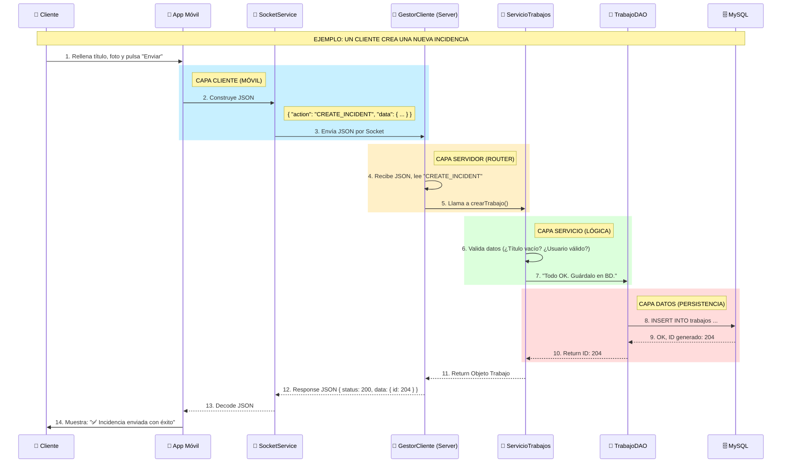

# Mapa Mental del Flujo de Datos en FIXFINDER (Móvil)

Este diagrama muestra paso a paso qué ocurre cuando un usuario realiza una acción desde la App Móvil, cómo viaja la información al servidor y cómo vuelve.

## Leyenda de Colores/Capas

- **(VISTA)**: Lo que ve el usuario (App Móvil Flutter).
- **(RED)**: El socket TCP/IP por donde viajan los JSON.
- **(ROUTER)**: Quien recibe y distribuye el trabajo en el servidor (Java).
- **(CEREBRO)**: Quien piensa y aplica las normas de negocio.
- **(MEMORIA)**: Quien lee/escribe en la base de datos MySQL.

---

## Mapa de Responsabilidades (Quién hace qué)

### 1. 📱 App Móvil (Vista/Cliente)

- Captura datos del usuario.
- Valida campos básicos (email válido, campo no vacío) antes de enviar.
- **NO** toma decisiones de negocio.
- Mantiene el socket abierto.

### 2. 🤵 GestorCliente (Servidor Router)

- Recibe el String JSON crudo.
- Parsea a objeto Java.
- Decide a qué Servicio llamar según el `action`.

### 3. 🧠 Servicios (Lógica Java)

- Aplica reglas de negocio complejas.
- Orquesta operaciones (ej: guardar en BD + notificar a admin).
- Maneja transacciones.

### 4. 💾 DAOs

- Escribe y lee SQL puro.
